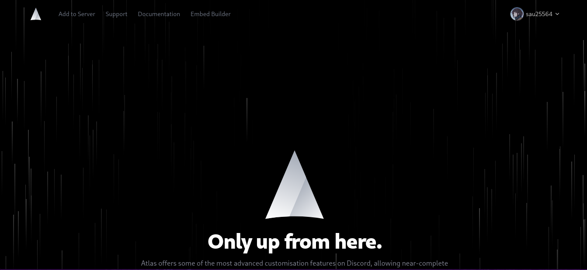
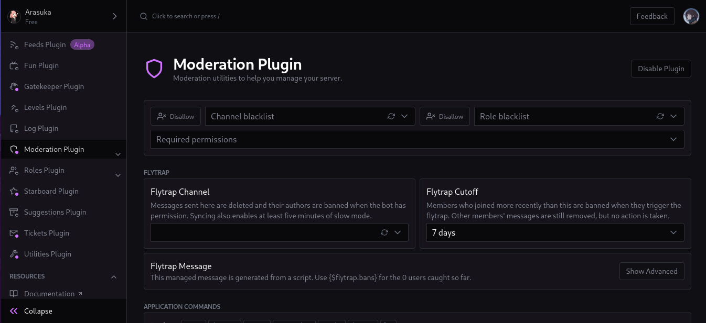
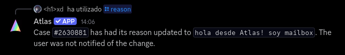
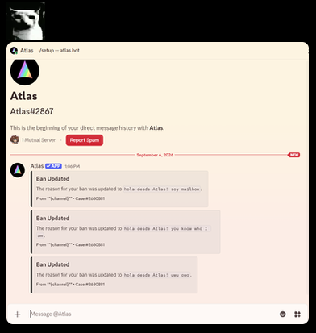

## Case updated... on a place that I don't even know?!??!?!?
*Fixed on: 06/09/2026*

[Website](https://atlas.bot) | [Discord](https://atlas.bot/support)

This Discord bot has some plugins, but is everything around [actions](https://docs.atlas.bot/learn/actions/your-first-action). It lets you create custom commands, triggers and other stuff using their own scripting language that is based on tags.

There is a moderation plugin, that has some useful stuff:

The plugin offers the command `/reason`:

> `/reason case_id:<Integer> updated_reason:<String> notify:<Boolean>`
> Adds or modifies a reason for an existing case.

A case is created when you warn, mute or ban a user. If the `notify` parameter is true, it will notify the user about the reason change. This seems usual for warn or mute cases... but for bans? If you can notify banned users about their case being updated, that would mean that you can send DM messages to users that aren't in your guild by just banning them.

I first tested with my user and indeed, the bot sent me the ban case update message. I had the preventive thought that this message was sent only if the user was previously in the guild, so I tested this with a friend that never joined my testing guild and the bot said:

I sent two other messages and it was still saying the same, I thought that everything was almost okay until my friend sent me this message:

The bot was saying that the user was not notified but *still* notified them, even if they had no relation whatsoever with my guild. This means that you can ban any user in your private guild, and message them as Atlas if they were in a server with the bot and had DMs open.

> The `/unban` slash command had the same flaw, tho.

The dev fixed it real quick.

