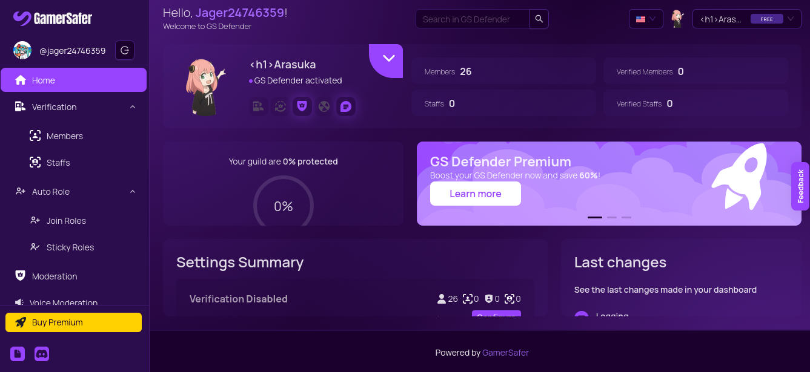
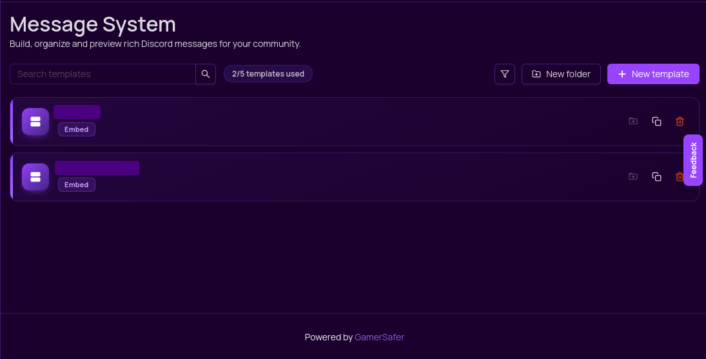
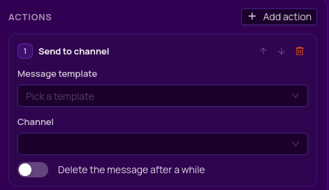
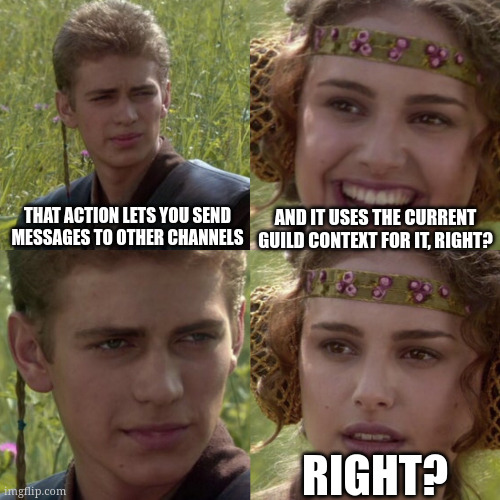

## The spam button
*Fixed on: 28/07/2026*

[Website](https://defender.gamersafer.systems/) | [Discord](https://discord.gg/Ez9aQYccDH)

This is a small security bot made by the GamerSafer organization (a well known Mojang/Microsoft partner, as it seems). It has some interesting functions beyond basic anti-raid/security stuff like age/identity document verification.



The dashboard allows admins to create message templates which can be sent by them, and also attach actions like giving roles, sending messages or forms using components (buttons, dropdown menus):



When you send one, a `POST` request is made to `/api/proxy/guild/[guild_id]/message-templates/[template_id]/send` which the template data and the target channel. I tried to change the `channelId` to a channel of another guild... but the server didn't allow it. So it's safe and everything is good.

Just joking. I started to inspect the actions things and I noticed that there was one that let's you send messages to a channel:



When you click a button with this action, the bot will send the respective message template to the channel. This thing looks like this in requests:

```json
{
    "type":"sendChannel",
    "templateId":"<String>",
    "channelId":"<String>"
}
```



When I entered a channel ID from my other guild and I triggered the button, the message was sent to the channel without any questions:

https://github.com/user-attachments/assets/659d46e8-162e-49bb-bfda-e67a80690ba8

As this was a raw message, pinging @everyone is possible, as you see in the video. The custom ids seems to be guild specific, so the buttons weren't functional. At least.

The devs fixed it quickly.
 


