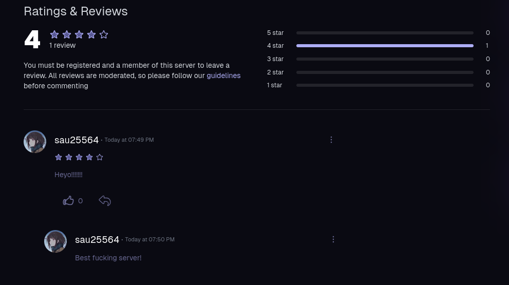

## Ruining your server's reputation!
*Fixed on: 14/09/2026*

[Website](https://guilds.me) | [Discord](https://guilds.me/discord)

This website is an alternative to Disboard and the Discord Discovery on which users can promote their guilds, so new members can join and also leave reviews of the server.


As I said, there's a reviews section, in which users can leave reviews and also other users (including the staff) can reply to them. It's something like a comments section:



When you're a staff of the listing you have some extra functions, like pinning messages, deleting other replies and reply with the server profile instead of your own. i.e., your response will be masked as the server name with their icon. This data is sent to the reply server action when you set that last option:

```json
[
    {
        "text":"<String>",
        "rating":"InRange([0,5])",
        "guildId":"<Snowflake>",
        "guildVanity":"$undefined",
        "reply":"<Boolean>",
        "reviewId":"<ObjectId>",
        "replyType":"guild"
    }
]
```

The action route is `/servers/[guild_id]`. If you try setting the `replyType` to `guild` on a reply in another guild where you aren't staff, the server will reject the action. But, what if I reference the `reviewId` of the target review in my own listing? If the respective document query is not scoped or validated, that would add a reply as the server inside a review of another listing, which will be shown as if the other listing were actually the one replying.

To get the review id, we can simply send a `GET` to `/api/guilds/[guild_id]/reviews`, which will return an array of reviews and looks as this:

```jsonc
{
    "_id":"<ObjectId>",
    "createdAt":"<Date>",
    "content":"<String>",
    "reviewer":"<User>",
    "rating":"<Integer>",
    "replies":"Array<Reply>"
    // ... [snip]
}
```

The `_id` field is clearly the one that we need. So referencing this ID while creating a reply on my listing indeed worked and created a reply as the other server in the target listing. This was also working for the delete and pin reply actions.

https://github.com/user-attachments/assets/8abbfbea-a761-47eb-a65a-9158de1fadd4

Pretty funny as you can practically remove every legitimate staff reply and replace it with your responses, as the target server.

The dev took a while to fix it.