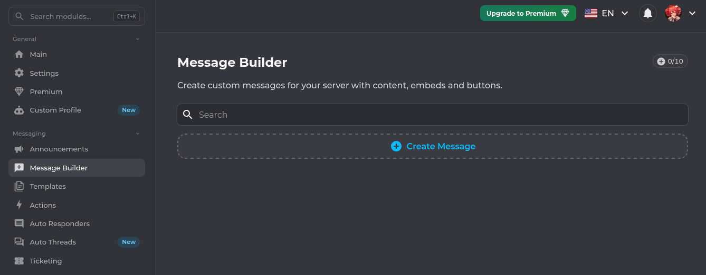
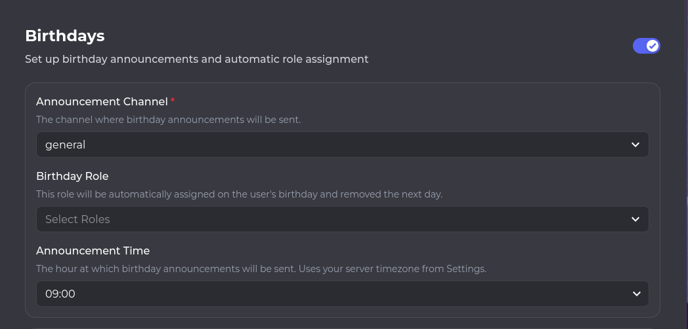

## I'm testing messages on your channels, sorry but no sorry!
*Fixed on: 15/04/2024 - 13/08/2026*

[Website](https://koya.gg) | [Discord](https://discord.gg/koya)

Koya is a One Piece themed multipurpose bot (I mean, the bot pfp is Luffy). It has various function and as I saw, one of the most used is the Welcome/Goodbye.

This bot has a message builder, it's for creating custom messages with/without embeds to use them as templates.



To send the message, a request to `/api/guilds/[guild_id]/messagebuilder` is sent:

```json
{
    "_id":"<ObjectId>",
    "name":"<String>",
    "channelId":"<Snowflake>",
    "content":"<String>",
    "status":"draft",
    "embeds":[
        {
            // Embed JSON
        }
    ],
    "buttons":"Array<DiscordButton",
    "actionRows":"Array<DiscordActionRow>",
    "components":"Array<DiscordComponent>",
    "messageType":"message",
    "webhook":{
        "id":null,
        "username":null,
        "avatar":null
    },
    "formId":"publish"
}
```

The `channelId` parameter was not verified to make sure that the channel belongs to the current guild. This allowed me to send messages as Koya everywhere, and actually in this one I can ping @everyone, if the bot had the default permissions.


I reported it to the dev, and he fixed it quickly.

Two years later, I decided to look again at the bot. There is a birthday module that lets configure the bot to announce birthdays at a specific hour.



When you save settings, this is sent to `POST /api/guilds/[guild_id]/birthdays`:

```json
{
    "enabled":"<Boolean>",
    "channelId":"<Snowflake>",
    "roleId":"<Snowflake>",
    "message":"<String>",
    "messageWithAge":"",
    "hour":"<Number>",
    "allowYear":"<Boolean>",
    "requireYear":"<Boolean>",
    "autoCleanupAnnouncements":"<Boolean>",
    "formId":"config"
}
```

Welp again, the `channelId` field had snowflake validation but not channel specific checks. I putted a channel from another guild, set my birthday to the next day at some hour and... the bot sent the birthday message there.

https://github.com/user-attachments/assets/042c7fed-c71d-45db-b091-8ad8937f9394

On this one I wasn't able to ping @everyone, as you can see in the video. Probably because the bot was sanitizing things in that message.

As the first, the dev fixed it quickly.