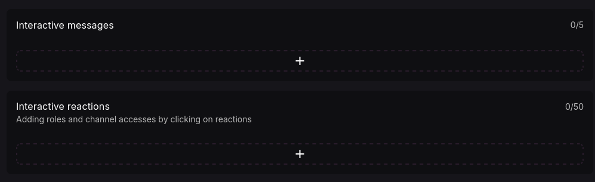

## Making your announcements interactive!
*Fixed on: 01/08/2026*

[Website](https://lacunabot.com) | [Discord](https://discord.gg/9NeMc3J)

It was a multi-purpose bot with few modules, but the main focus is on the scripting language for custom commands/actions; it used a custom [V8](https://v8.dev/) JavaScript engine to allow users to code their own handlers or commands. The bot was discontinued and the devs made all the code [open source](https://github.com/LacunaHub), this was before that happened.

On the Utility dashboard section, I saw the `Interactive messages` and `Interactive reactions` modules, which lets you create custom messages with components/embeds and reactions that can add roles 



When you create one message, a `POST` request is sent to `/guilds/:guild_id/settings/interactive-messages` with this body:

```jsonc
{
    "channel_id":"<Snowflake>",
    "message":{
       // Partial<Message>
    },
    "components":{
        // Partial<MessageComponent>
    },
    "reactions":[
        // Array<Reaction>
    ]
}
```

And this is sent via `POST` to `/guilds/:guild_id/settings/interactive-reactions` if you create a reaction:

```json
{
    "id":"<String>",
    "type":"OneOf<ROLE,CHANNEL>",
    "element":{
        "single":"<Boolean>",
        "reverse":"<Boolean>"
    },
    "message":{
        "channel_id":"<Snowflake>",
        "id":"<Snowflake>"
    },
    "emoji":"<String>",
    "references":["<Snowflake>"]
}
```

The backend wasn't checking if the `channel_id` actually belonged to my guild on both endpoints, so I can send the message to anywhere with the ability of pinging `@everyone` if the bot has the default permissions:

https://github.com/user-attachments/assets/c81f7577-cb97-40ae-81c1-c6712c4c346a

A fun thing is that I can also edit the messages. The only catch is that there is a bit annoying ratelimit on those endpoints, so you can't spam too much.

The devs took some weeks to fix it.

