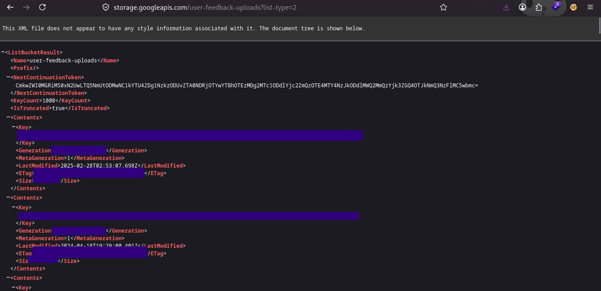

## I know what you are
*Fixed on: 21/06/2026*

[Website](https://www.midjourney.com) | [Discord](https://discord.gg/midjourney)

Midjourney is a website used for AI multimedia generation. On their beginning, the only way to use it was by having a Discord account, so is widely known around there and it has the biggest Discord server with 18M+ users. A [Discord bot](https://discord.com/oauth2/authorize?client_id=936929561302675456&scope=bot) for using the main platform features is also available. 


At this date, the service can only be used if you pay a subscription, so I began to try to access to functions that were paywalled. While searching for API endpoints in the frontend assets I found an endpoint called `/api/storage-upload-feedback?file={filename}`. This endpoint would return this:

```jsonc
{
  "url":"https://storage.googleapis.com/user-feedback-uploads/",
  "fields":{
    "x-goog-meta-user_id":"{user.id}",
    "x-goog-meta-type":"image-prompt",
    "x-goog-meta-origin":"web",
    "key":"{filename}",
    // snip
  }
}
```

That url points to a [Google storage bucket](https://docs.cloud.google.com/storage/docs/buckets), and as the name indicates, it's where user uploaded files for support related things are stored. You may be expecting this to have protection... but no, I was able to list and access all stored files in the bucket even without authentication:



The most interesting thing is that every file had his associated `user_id` in the name. So mapping every attachment to the user who uploaded it was easy. As it's for feedback/support stuff, there were various screenshots leaking PII (Personal Identifiable Information), receipts, billing information and full system screenshots. Here's a sample one:


And yes, there were attachments getting added recently.

> Friendly reminder that you should not upload sensitive information unless it's really needed.

I reported it, but the devs didn't give me a callback. They took one or two hours to fix it at least.