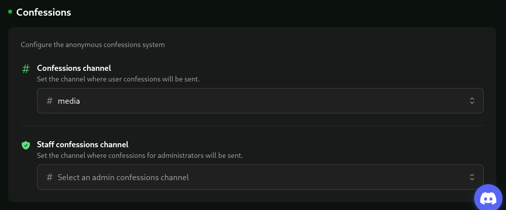
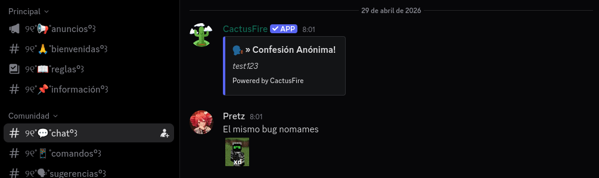

## I'll confess my sins... but in your announcements!
*Fixed on: 03/01/2024 - 02/05/2026*

[Website](https://cactusfire.xyz) | [Discord](https://discord.cactusfire.xyz)

CactusFire is (or was) a multipurpose bot focused on games rather tan other things. Between 2020 and 2024 it was on his peak of activity, being used on a lot of hispanic Discord servers.

Their dashboard is pretty simple, they don't have many settings, but an interesting thing is that you can set the confessions channel (for users and staff):



The backend didn't validate if those channels actually belonged to the guild that is being configured, so by intercepting the `PATCH` request and editing those two fields:

```json
{
    "data":{
        "confessionsChannel":"<snowflake>",
        "adminConfessionsChannel":"<snowflake>"
    }
}
```

Would allow you to send confessions with the `/confess` command to channels where you probably don't have permission to send messages. Pretty simple to abuse.



As it was in an embed, pinging @everyone was not possible, but still can be used to troll (the bot asks for administrator permissions by default).

I originally reported this bug on 03/01/2024 and it was fixed, but for some reason the dev decided to recode the dashboard, and introduced it again. So it was fixed on 02/05/2026.

