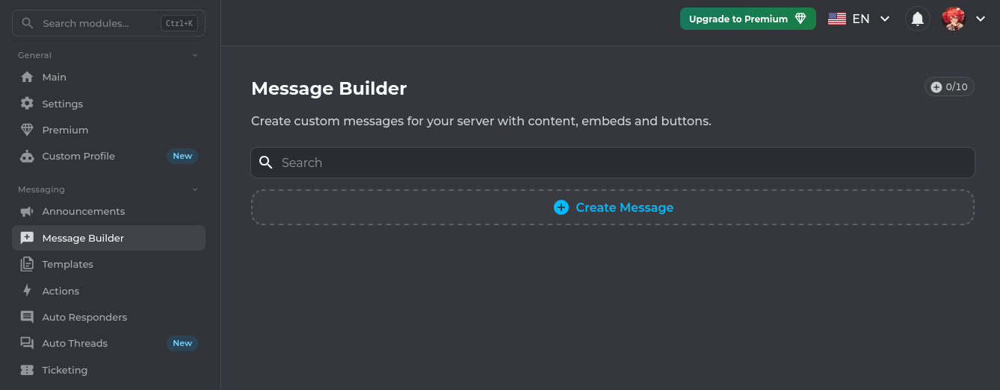

## I'm testing messages on your channel, sorry but no sorry!
*Fixed on: 15/04/2024*

[Website](https://koya.gg) | [Discord](https://discord.gg/koya)

Koya is a multipurpose bot which bases it's thematic on the One Piece anime (I mean, the bot pfp is Luffy). It has various function and as I see, one of the most used is the Welcome/Goodbye.

This bot has a message builder, it's for creating custom messages with/without embeds to use them as templates.



To send the message, a request to `/api/guilds/:guild_id/messagebuilder` is sent:

```json
{
    "_id":"",
    "name":"test",
    "channelId":":channel_id",
    "content":"test123",
    "status":"draft",
    "embeds":[
        {
            // Embed JSON
        }
    ],
    "buttons":[],
    "actionRows":[],
    "components":[],
    "messageType":"message",
    "webhook":{
        "id":null,
        "username":null,
        "avatar":null
    },
    "formId":"publish"
}
```

The `channelId` parameter was not verified to make sure that the channel belongs to the current guild. This allowed me to send messages as Koya everywhere, and actually in this one I can ping @everyone, if the bot had the default permissions.


I reported it to the dev, and he fixed it quickly.