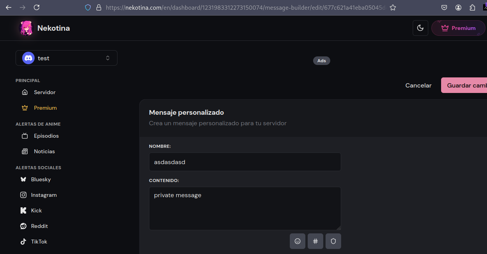
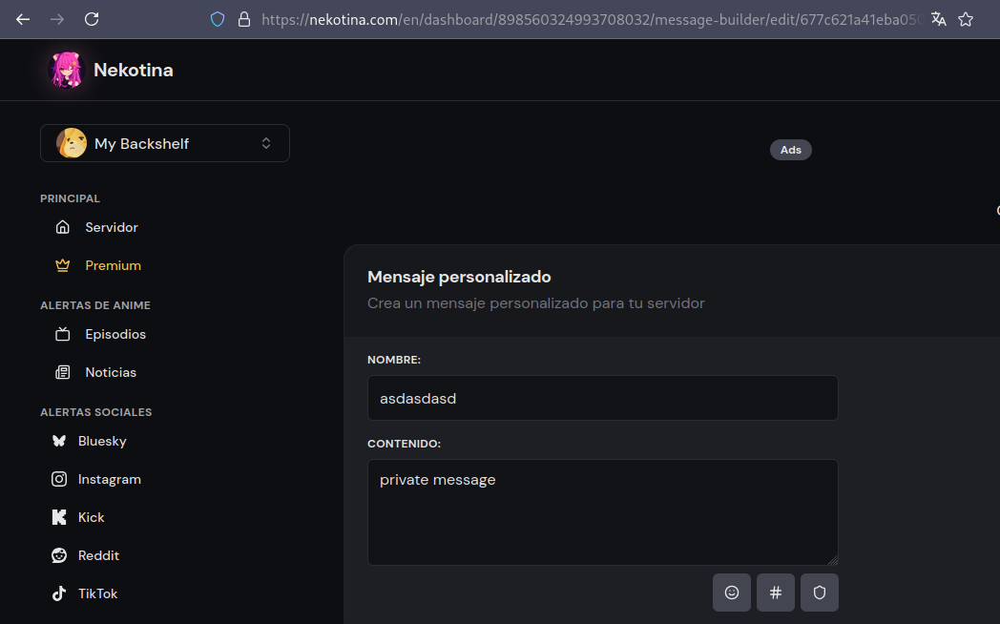
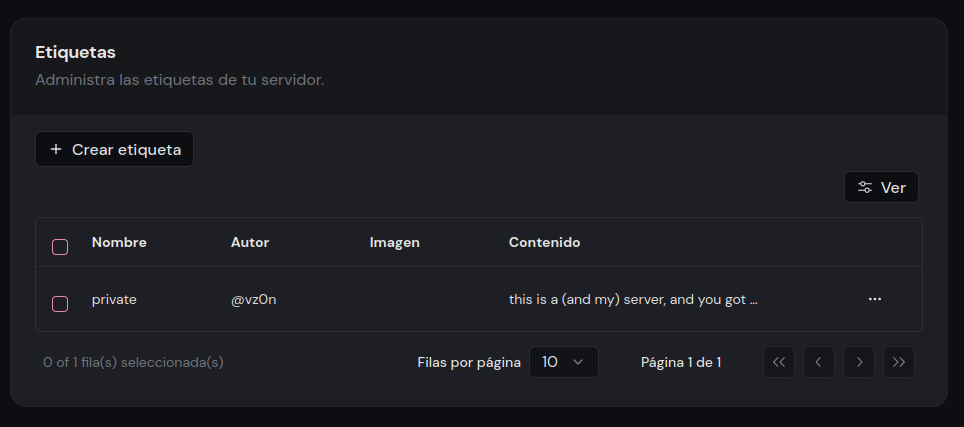

## Accessing to your items!
*Fixed on: 12/01/2025*

[Website](https://nekotina.com) | [Discord](https://nekotina.com/discord)

Nekotina is a mainly spanish multi purpose bot that is basically a must-have in almost all of the Discord spanish community. The most used features are the interaction/roleplay commands and global economy system.

The bot to identify objects was using UUIDs on some sites, but on others it was using BSON:

So, I decided to test for basic IDOR, I tried to copy the BSON identifier of a message builder's message from one of my servers on an account and access it from other account... and it worked (Notice the server IDs)

I was able to delete it also. The same was happening with server tags but here I could edit them:

By testing, I identified that these modules were vulnerable (strangely, these modules were using BSON to identify objects):

- Automation -> Recurring Messages: Available when deleting
- Server Store -> Items: Available when editing, deleting, and viewing
- Miscellaneous -> Message Builder: Available when deleting and editing, but you can only view and not save changes (When you save, a duplicate message will be created in your guild with the same content as the message you referenced)
- Miscellaneous -> Tags: Available when editing, deleting, and viewing
- Entertainment -> AI Roleplay: Available when viewing and deleting

I reported it, and on 2/3 days the two devs contacted me to notify that the issues were fixed.