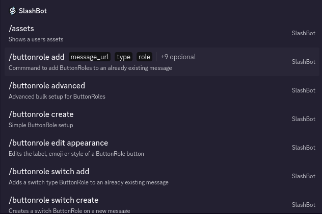
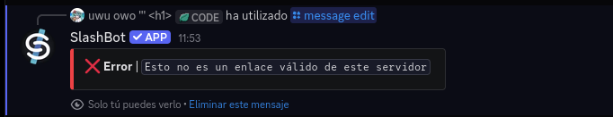

## Adding free Robux buttons to your messages!
*Fixed on: 20/07/2026*

[Website](https://slashbot.xyz) | [Discord](https://slashbot.xyz/discord)

It's a utility bot that provides functions for creating interactive component-based messages.

The bot has various commands that allows editing previously sent messages by the bot. Every one of them requires you to enter a Discord message URL to said message.



`message_url` follows the format `https://discord.com/channels/{guild.id}/{channel.id}/{message.id}`.

At the first glance, if I try to edit a message in other server, the bot says this:



Or in english, "This is not a valid message link of this server".

So I'm fucked?... No, let's think on something: Discord actually treats guilds and channels as separate entities, and most wrappers can fetch a channel by its ID even if it's not from your guild. I tought that the bot is splitting the URL by the `/` char and grabbing the last three components (that is, the guild ID, channel ID and message ID), and then this:

```py
if guild_id != ctx.guild.id:
    return send_error_message("This is not a valid message link of this server")

channel = ctx.client.get_channel(channel_id)
message = channel.get_message(message_id)
```

The big flaw here, is that the channel is being retrieved from the client itself and not from the context guild. That will still allow tampering from messages in other servers by just changing the `{guild.id}` in the URL by the one of your current guild... and seems that was exactly happening here:

https://github.com/user-attachments/assets/596c38a3-13de-48f4-885c-bf05109aa023

So yes, I was able to edit any message sent by the bot on other servers.

The dev fixed it quickly.