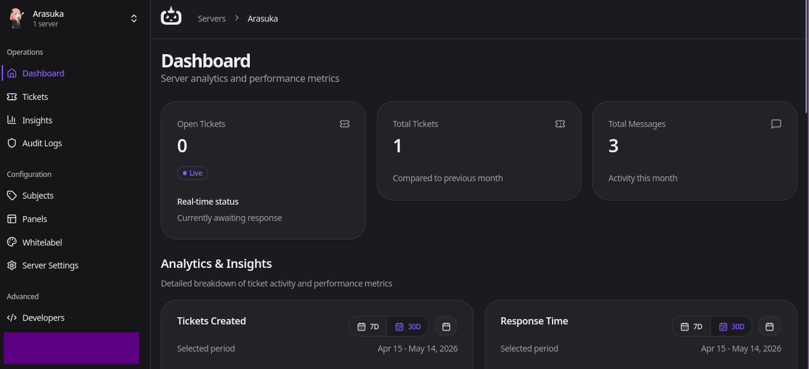
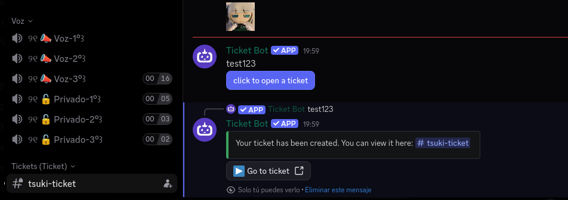

## Let me use your server for my tickets
*Fixed on: 09/05/2026*

[Website](https://ticketbot.xyz) | [Discord](https://ticketbot.xyz/discord)

It's a simple and not very known ticket managing bot with some nice functions and a pretty good dashboard to be honest. Got interest on it because it was on the HackTheBox Discord guild.



When you create a panel, this is sent via `POST` to `/setting/servers/$guild_id/panels` (creating a panel with a simple message and a button for the subject):

```json
{
    "serverId":"$guild_id",
    "type":"BUTTON",
    "subjects":[
        {
            "subjectId":"$subject_id",
            "text":"test",
            "style":1
        }
    ],
    "integrationDetails":{
        "channelId":"$channel_id",
        "serverId":"$server_id"
    },
    "message":{
        "content":{
            "type":"doc",
            "content":[
                {
                    "type":"paragraph",
                    "content":[
                        {
                            "type":"text",
                            "text":"uwu owo"
                            }
                    ]
                }
            ]
        },
    "embeds":[]
    }
}
```

The `channelId` parameter was being type-validated, but the server didn't check if the channel actually belongs to the guild. That allowed me to send panels to other servers (and with the ability to ping everyone if it was with the default permissions)

What made it more funnier, is that the button was actually working, and it creates the ticket under the default server subject:



The endpoint used for editing the panel was also vulnerable, allowing you to edit messages sent by the bot in other servers.

The devs fixed it quickly after I reported it.