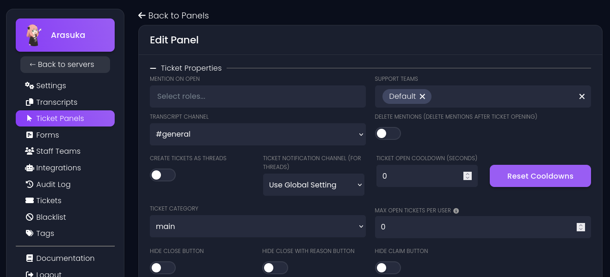
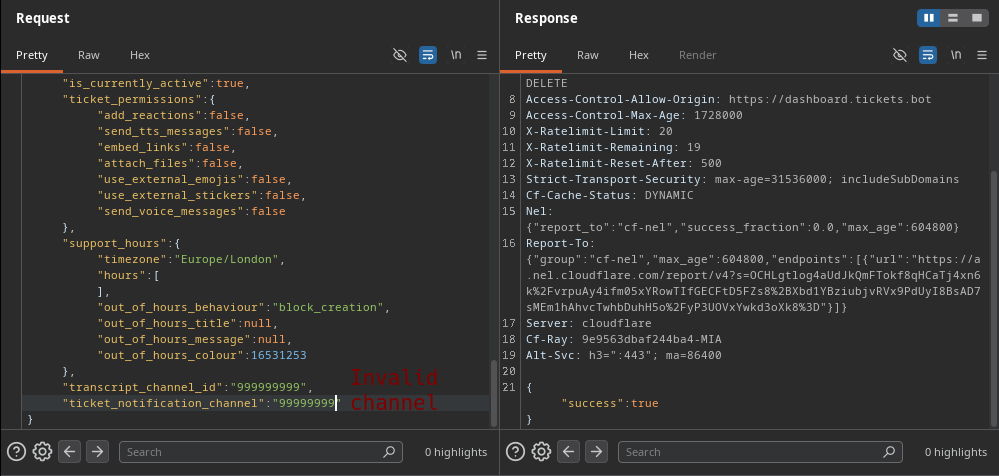

## Hey, you can't put th- oh it's disabled, go ahead then.
*Fixed on: ??/04/2026*

[Website](https://tickets.bot) | [Discord](https://discord.gg/ticketsbot)

It's another ticket management system, and as I know, is a continuation of another discontinued tickets bot.

On their dashboard, when you create a ticket panel, you have various options to set:



The settings are saved via a `PATCH` to `/api/:guild_id/panels/:panel_id` with the following data:

```json
{
    "message_id":":snowflake",
    "channel_id":":snowflake",
    "title":"Open a ticket!",
    "content":"By clicking the button, a ticket will be opened for you.",
    "colour":3066993,
    "category_id":":snowflake",
    "welcome_message_embed":813293,
    "default_team":true,
    "custom_id":"hxThheGfnbKSVeaQceplIJVzGODPqG",
    "button_style":"1",
    "button_label":"Open a ticket!",
    "form_id":null,
    "naming_scheme":null,
    "force_disabled":false,
    "disabled":false,
    "exit_survey_form_id":null,
    "pending_category":null,
    "delete_mentions":false,
    "transcript_channel_id":":snowflake",
    "use_threads":false,
    "cooldown_seconds":0,
    "ticket_limit":0,
    "hide_close_button":false,
    "hide_close_with_reason_button":false,
    "hide_claim_button":false,
    "welcome_message":{ 
        // [snip]
    },
    "use_custom_emoji":false,
    "emote":"📩",
    "mentions":null,
    "teams":[],
    "use_server_default_naming_scheme":true,
    "access_control_list":[{"role_id":":snowflake","action":"allow"}],
    "has_support_hours":false,
    "is_currently_active":true,
    "ticket_permissions":{
        // [snip]
    },
    "support_hours":{
        "timezone":"Europe/London",
        "hours":[],
        "out_of_hours_behaviour":"block_creation",
        "out_of_hours_title":null,
        "out_of_hours_message":null,
        "out_of_hours_colour":16531253
    },
    "ticket_notification_channel":null
}
```

I tried to put a random number in `transcript_channel_id` and it worked, also with a channel ID from another guild. That allowed me to send the transcript message to other channels where probably I can't write.

Now, with the `ticket_notification_channel` field this also happened, but only if the `use_threads` field was set to true, and there was a global option for enabling threads even if the panel explicitly had it disabled. I can do the same as above but with the notification messages (when a ticket is opened, and so on)



Don't know how much the dev took to fix it, as an admin got mad at me for using this on a public channel (to prove that you can do what i'm saying) and closed the ticket. But yeah, it's fixed now.