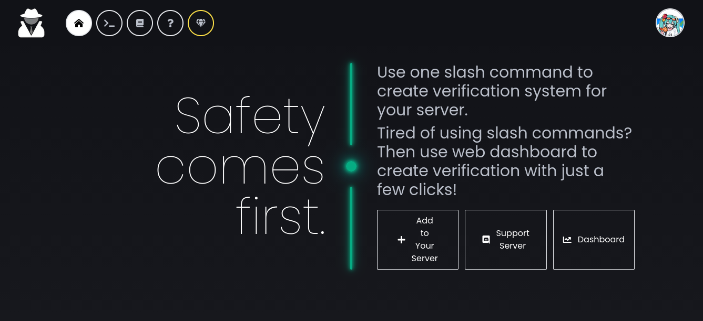
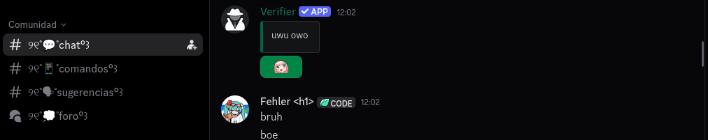

## Just using your announcements channel as verification, don't mind me
*Fixed on: 19/07/2026*

[Website](https://verifierbot.xyz) | [Discord](https://verifierbot.xyz/support)

This is a security bot made mainly for member verification purposes, to prevent raids of self bots and other things.



When you create the verification message on the dashboard, a `POST` request is sent to `/api/@me/guilds/[guild_id]/verification` with the following JSON body:

```json
{
    "welcomeMessage":"<string>",
    "welcomeChannelID":"<string>",
    "unverifiedRole":"Array<string>",
    "verifiedRoles":"Array<string>",
    "verificationType":"click-to-pass|web|...",
    "emoji":"<Emoji>"
}
```

So, the backend didn't check if the `welcomeChannelID` actually belonged to the current context guild. That means I can send the message to anywhere:



The downsides is that @everyone is not possible and the dashboard has an absurd cooldown of 20-25 seconds per request. So spamming is not feasible at all. 

The dev fixed it quickly.