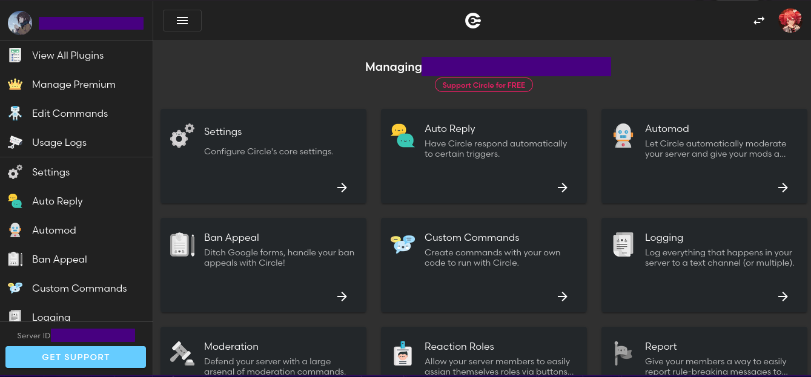

# Let's assign everything!
*Fixed on: 28/03/2024*

[Website](https://circlebot.xyz) | [Discord](https://circlebot.xyz/support)

Circle is a multipurpose bot, much like the other. It has modules like custom commands, ban appeal handling, reaction roles, Roblox link... etc.



I was testing for things for the custom command modules, and I saw that a request was made to `/api/guilds/:guild_id/customcommmands/:command_id`:

```json
{
    "_id":":command_id",
    "id":":guild_id",
    "name":"owot",
    "enabled":true,
    "responses":[
        {
            "channel":"current",
            "message":{
                "content":"test"
            }
        }
    ],
    "requiredRoles":[],
    "requiredChannels":[],
    "ignoredRoles":[],
    "ignoredChannels":[],
    "description":null,
    "usages":[],
    "examples":[],
    "__v":0,
    "exportHash":"uwuewe",
    "edit":true
}
```

I edited the `id` parameter to set an ID of another guild... and the command disappeared from my config. 

When I saw my custom command list from the other guild, the command was there... and I was able to run it. I tried this with other plugin, and it worked, it was working with **every** plugin available. 

Most of the plugins were disabled, so at least servers that invited the bot without making any configuration are "safe".

Devs quickly fixed it after reporting it and gave me a reward.

