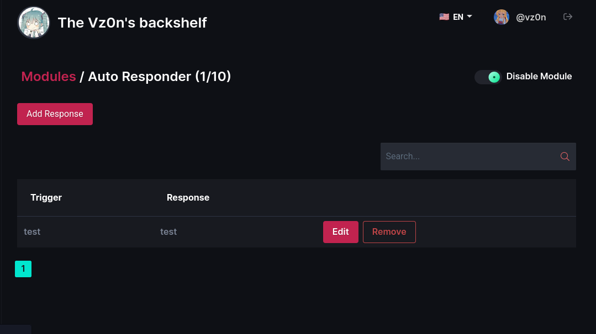
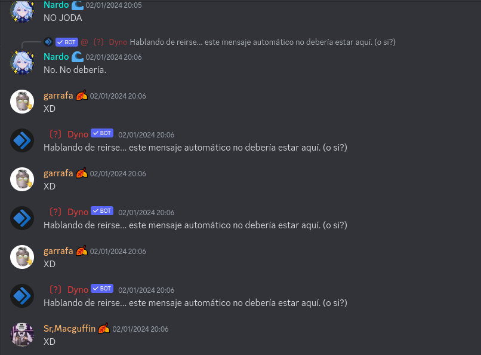
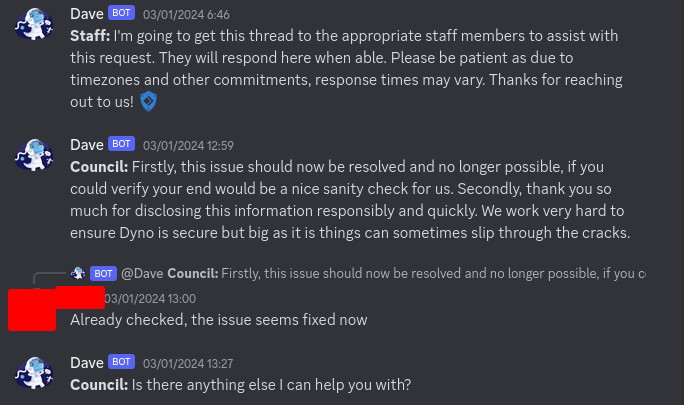

## This message should not be there... or actually yes?
*Fixed on: 03/01/2024*

[Website](https://dyno.gg) | [Discord](https://discord.gg/dyno)

You must already know Dyno, so I'll skip his presentation. But in summary is another widely used multi-purpose bot.

On the dashboard, there is a module called Auto responder:



When you edit an already created auto response, this request is sent to `/api/server/:guild_id/autoresponder/edit/:response_id`:

```json
{
    "command":{
        "command":"test",
        "response":"test",
        "type":"message",
        "allowedChannels":{
            "channels":[]
        },
        "ignoredChannels":{
            "channels":[]
        },
        "allowedRoles":{
            "roles":[]
        },
        "ignoredRoles":{
            "roles":[]
        },
        "reactions":{
            "reactions":[]
        },
        "wildcard":false,
        "guildId":":guild_id",
        "embed":null,
        "cooldown":null,
        "choices":null,
        "id":":autoresponse_id",
        "createdAt":"2026-04-29T22:21:16.724Z",
        "updatedAt":"2026-04-29T22:21:16.724Z"
    }
}
```

As you may already guess, the `guildId` attribute was edited in this request, allowing you to change the guild that the auto response belongs to. As this module is enabled by default, I had a good chance to put several autoresponses with wildcards like "a*" and a "@everyone" or something else to cause havoc across servers. I tested it on some guilds:



I reported this, and the Dyno team fixed it quickly... guess because it was only a day ago since [this video from No Text To Speech with xyzeva](https://www.youtube.com/watch?v=VFpWScRJ6Ac)



Why that guess? Because I found other vulnerabilities like this one but less harmful, and I reported them a very long time ago after this, but the devs seems that were too lazy to fix them in a short/normal time span.