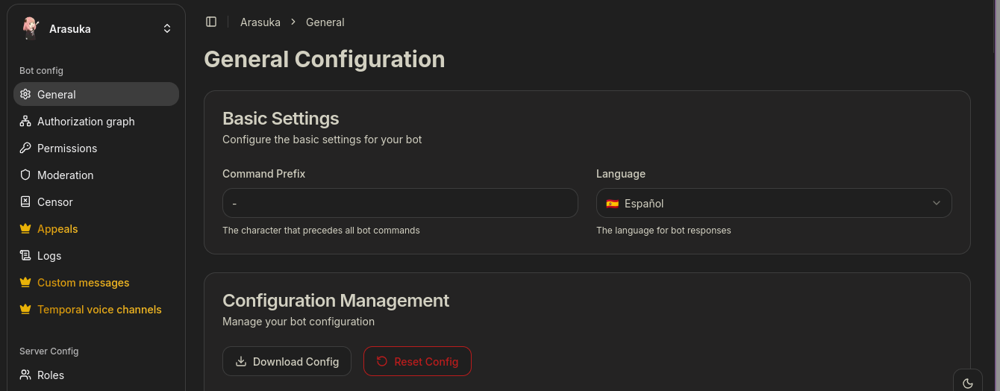
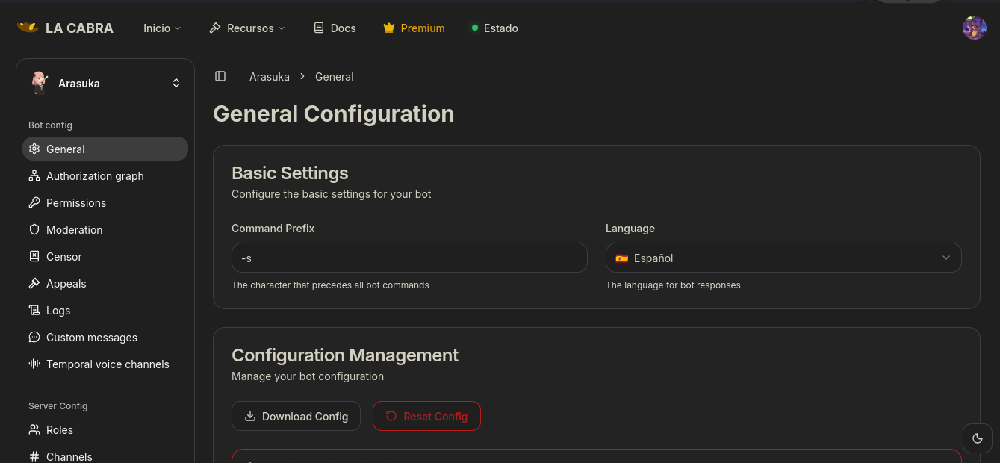
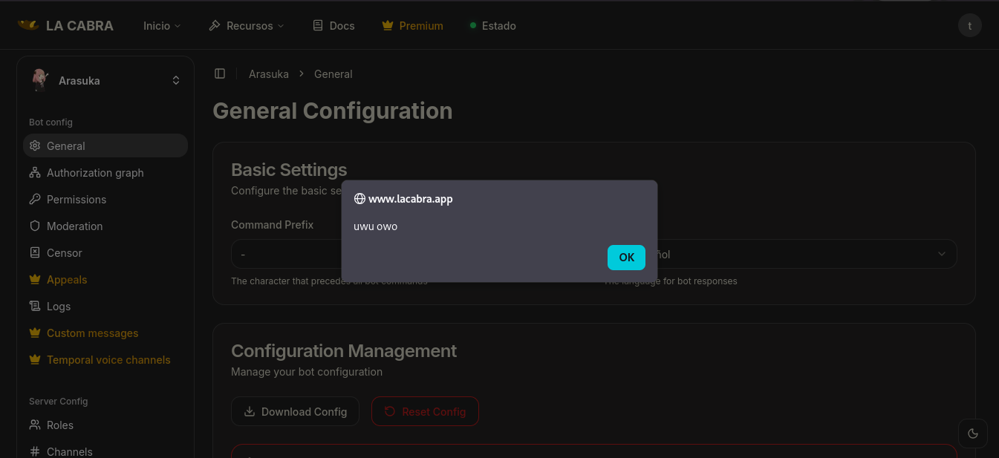

## This must be a joke
*Fixed on: 12/05/2026*

[Website](https://www.lacabra.app) | [Discord](https://discord.gg/SJqrGP7)

It's a moderation bot with anti-raid and other things, simillar to Wick. It's less known that other bots around there but it seems that is known between popular big hispanic servers. His name translated to english is "The Goat".

Their dashboard seems simple:



To save settings in the dashboard, a `POST` request is sent to `/config/:server_id`

```jsonc
{
    // It's a big chunk of JSON, so imma cut it to the insteresting fields
    // [... snip]
    "external_edited":true,
    "id":":server_id",
    "lang":"es-ES",
    "premium": false
    // [... snip]
}
```

Welp... for some reason, the dashboard was using the `id` field to identify the server that it was going to save the config instead of using the parameter in the URL, and I was able to edit it. That allows me to replace the config of other servers with the mine (essentially, that's giving me full admin access to the server dashboard)

This also mass assigns other parameters that a user should not be allowed to edit, like the `premium`. With this you could enable and disable premium for any other server:



Even more, the YAML configuration was editable in the request, and every HTML tag in the config was being rendered... so getting XSS is easy:



The devs fixed it quickly after my message reached them. 