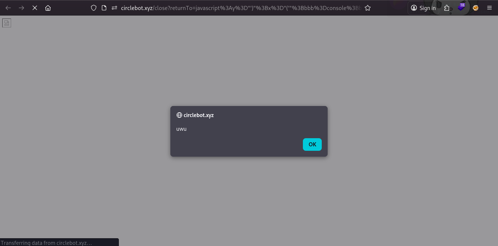

## javascript:alert('square');
*Fixed on: 17/02/2026*

[Website](https://circlebot.xyz) | [Discord](https://circlebot.xyz/support)

Circle is a multipurpose bot, much like the other. It has modules like custom commands, ban appeal handling, reaction roles, Roblox link... etc.

After authorizing the app to log-in into the dashboard, Circle in the path `/close` uses the `returnTo` parameter to redirect the user to the desired location, but it was not doing any validation against that parameter. As it was setting `window.location.href` directly, I was able to get XSS by doing a quick Cloudflare WAF bypass:

They solved it some hours after I made the report.