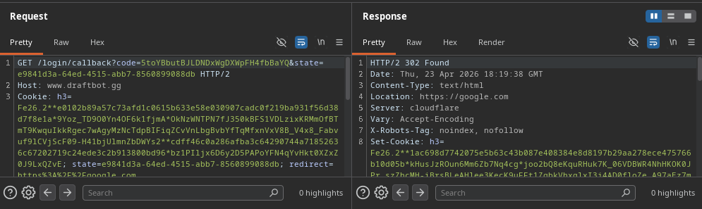

*Fixed on: 24/04/2026*

[Website](https://draftbot.gg) | [Discord](https://discord.gg/draftbot)

DraftBot is a (mainly) multi-purpose french bot with various functions like Dyno and Sapphire.

On this one, the `/login/callback` didn't verify anything against the saved URI in the `/login?redirect=[URI]`, so it will redirect to wherever you specify in the `redirect` parameter:

The dev fixed it after a day, with the other vulnerabilities.