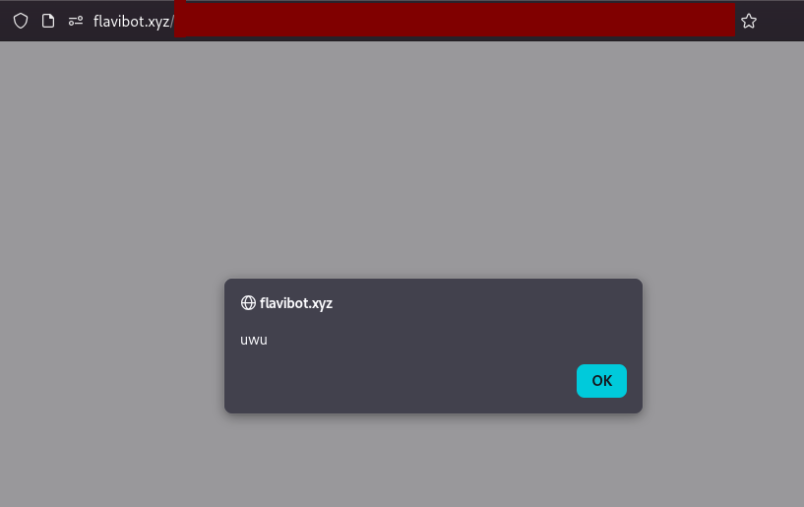

## javascript:alert('uwu');
*Fixed on: 25/01/2026*

[Website](https://flavibot.xyz) | [Discord](https://discord.gg/zJyE39J)

This bot is a multi-purpose one, but it's more known and used for the music function, seems very popular on those type of bots.

As Circle, the backend didn't verify the `redirect` parameter saved on the first request to `/auth/discord/login`, so, going to `/auth/discord/callback` will redirect you to anywhere you specify. It was using `window.location.href` to redirect and using the Cloudflare WAF, so bypassing it again:

I reported it and the dev told me that this was only happening on Firefox. I think that guy was a *bit wrong* about this because I tested with a friend the Circle bug and it was working on browsers like Safari and Chrome. But I don't know if the frontend does something only on Firefox, so well.