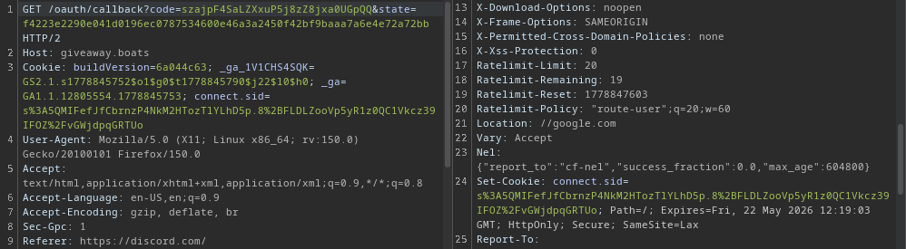

## Roblox scammers are really dumb
*Fixed on: 16/05/2026*

[Website](https://giveaway.boats) | [Discord](https://giveaway.boats/support)

It's a giveaway focused bot with good features, like the old [GiveawayBot](https://giveawaybot.party/) but better I would say.

Welp, the `/oauth/login` endpoint used for the Discord authorization didn't account for protocol relative URLs in the `redirect_uri` param, so a simple open redirect; easy to find but not very useful.

A thing that got my attention on the support server at the moment, is that I noticed that there are some Roblox idiots trying to impersonate the bot to scam people by a "5.000 Robux giveaway":

The button sends you to the `giveawaybot(.)cc` domain, and I guess that is a wacky phishing to steal your Roblox or Discord account. They could have used this bug to make scams *a bit* more easier to fall, but for luck, they were not smart enough (negative IQ) to find it.

The dev fixed it quickly, even being just a minor issue.