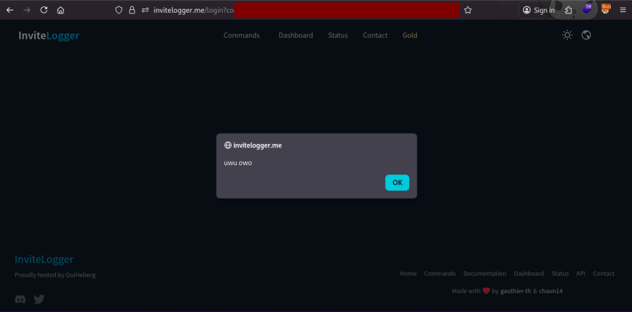

## State being state
*Fixed on: 09/03/2026*

[Website](https://invitelogger.me) | [Discord](https://discord.gg/CxE6gyT)

As it name says, the bot is mainly made for invite things like logging, detect fake invites and so on.

On login, this bot was using the `state` parameter of the OAuth2 protocol to redirect users to the desired page, and as Circle and FlaviBot; no verification and using `window.location.href`. Here the Cloudflare WAF was not present and, welp, more easy:

The dev fixed it on a hour after the report.