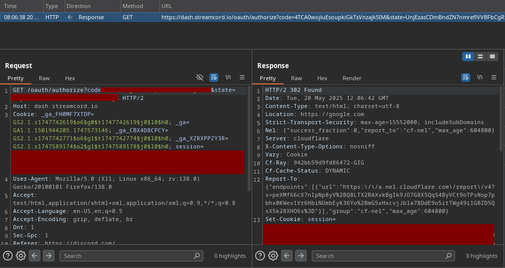

*Fixed on: 20/05/2025*

Streamcord is a widely used bot by influencers, youtubers and streamers to notify users about new content.

Their `/oauth?next=<uri>` dashboard endpoint didn't make any validation of the url in the `next` param (took this photo on 2025, idk why I made the stupid censor):

The dev took some hours to fix it.