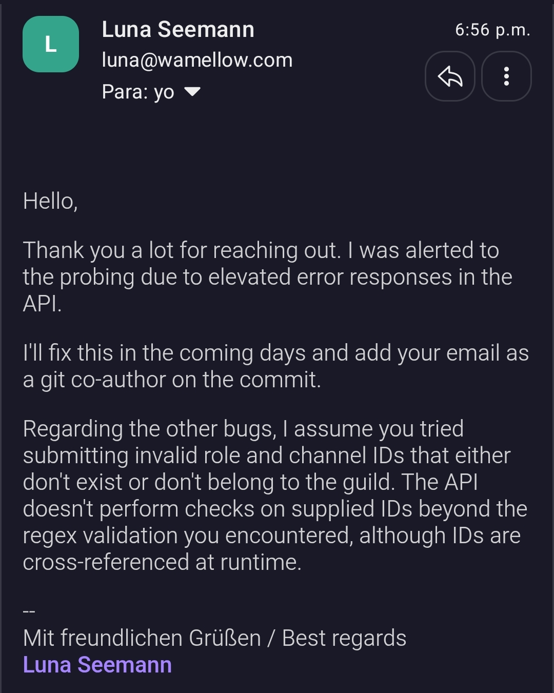

*Fixed on: 30/06/2026*

[Website](https://wamellow.com) | [Discord](https://wamellow.com/support)

It's a multi-purpose Discord bot focused more on accessibility and fun stuff, like posting random Neko girls/[Blahajs](https://www.ikea.com/us/en/p/blahaj-soft-toy-shark-90373590/) images on channels, text to speech, and so on. The frontend of the website is [open source](https://github.com/shi-gg/mellow-web).

By looking at the source code, at `app/login/route.ts` I noticed this function:

```ts
function parseRedirectUrlFromState(state: string | null) {
    if (!state) return "/";

    const path = decodeURIComponent(state);
    if (path.includes("://")) return "/";

    return path || "/";
}
```

This seems like a solution that you can think by watching a normal URL, but protocol relative URLs exists and most user agents transforms a URL like `http:/google.com` into `http://google.com`. So you can easily bypass it:

https://github.com/user-attachments/assets/3750273e-06ce-4852-8a8f-f9525d1e691a

The dev said that it was going to fix it in the coming days, but [it made the fix quickly](https://github.com/shi-gg/mellow-web/commit/33a61ae687beaaf2810779499c750f2432b1354e) at the day of the report. She watched me doing strange things in the website before I reported the bug, but it was nice and even added me as the co-author of the fix commit. 

