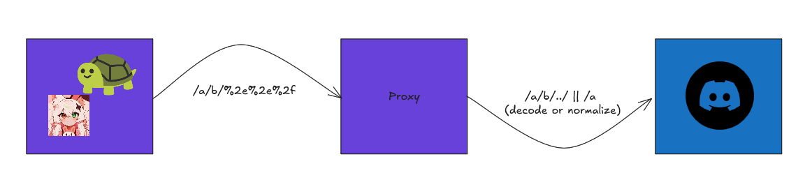

This vulnerability is based in certain bugs, how the [Discord REST API](https://discord.com/developers/docs) works, and the behaviour of various HTTP clients, so let's see...

As you may know, on Discord, important parameters like the IDs (Snowflakes) of objects are introduced in the final URL of the request that is going to be sent. For example: to get a channel message you do a `GET` request to:

```
https://discord.com/api/vY/channels/:channel_id/messages/:message_id
```

If you send a request to the API that contains in the path a sequence of chars that represents the previous path (that is `../`), it will issue a redirect to the translated URL (normalizes it):

```bash
$ curl -I --path-as-is "https://discord.com/api/v10/users/../"
HTTP/2 302 
date: Mon, 27 Apr 2026 17:13:42 GMT
content-type: text/html; charset=UTF-8
content-length: 0
location: https://discord.com/api/v10/
cache-control: private
alt-svc: h3=":443"; ma=86400
... [snip]
```

Now, that is what happens on HTTP clients that threat the request as it is and does not follow redirects by default, but various clients (like the Node.js fetch) does this normalization *before* sending the request:

```js
> let req = await fetch("https://discord.com/api/v10/../")
undefined
> req.url
'https://discord.com/api/'
> req.redirected
false
```

and as Python's `requests`, they will follow the redirect by default. Moreover, it's stated in the HTTP protocol that clients must change the request method to `GET` for the next request after receiving the 302 redirect status code only if the original request method is `POST`, but no `DELETE`, `PATCH`, or `PUT`.

There are also libraries that url-encodes parameters (like [discord.js](https://discord.js.org)) before sending, but it's pretty normal for big bots to use proxies to send requests to Discord (preventing rate limits), and every url-encoded stuff in the URL usually gets decoded by the proxy server before reaching the code that sends the request to Discord API, so you end up with this:



> Also, if there is a fragment after your input (like `/messages` if you're sending a message to a channel), you could also *eliminate/cancel* it by just appending the start-of-query character (`?`) or the fragment (`#`) at the end of your input, so the server won't consider it as part of the real URI.  

On the case of Discord bots, they usually allow user actions like sending reactions, assigning roles and sending messages from the dashboard. So if there is poor user-input validation, with this you could convert a simple embed editing tool into a nuke tool. This bug also applies for other things that inserts user input into a request URI.

This is a good example on what happens when you don't validate user input.