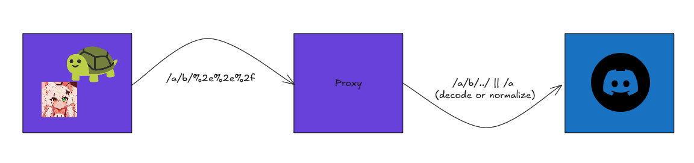

This vulnerability class is a generalized version of path traversal for every context possible. Like client side requests (Client Side Path Traversal), filesystem file reads (the generic path traversal that you may know about), and server side API requests. But most cases here are about this technique applied to Discord bots, so here's a description of that:

As you may know, in Discord, important parameters like the IDs (Snowflakes) of objects are passed in the final URL of the request that is going to be sent. For example: to get a channel message you do a `GET` request to:

```
https://discord.com/api/vY/channels/:channel_id/messages/:message_id
```

If you send a request to the API that contains dot segments (`../`) in its path, the API will issue a redirect to the translated URL (it normalizes it):

```bash
$ curl -I --path-as-is "https://discord.com/api/v10/users/../"
HTTP/2 302 
date: Mon, 27 Apr 2026 17:13:42 GMT
content-type: text/html; charset=UTF-8
content-length: 0
location: https://discord.com/api/v10/
cache-control: private
alt-svc: h3=":443"; ma=86400
... [snip]
```

Now, that is what happens on HTTP clients that treat the request as it is and do not follow redirects by default, but various clients (like the Node.js fetch) do this normalization *before* sending the request:

```js
> let req = await fetch("https://discord.com/api/v10/../")
undefined
> req.url
'https://discord.com/api/'
> req.redirected
false
```

and as Python's `requests`, they will follow the redirect by default. Regarding methods: the HTTP spec only *allows* clients to rewrite `POST` as `GET` for the next request after a `302` (a historical quirk that most clients follow anyway), while `PUT`, `DELETE`, and `PATCH` are re-sent with the same method.

There are also libraries that url-encode parameters (like [discord.js](https://discord.js.org)) before sending, but it's pretty normal for big bots to use proxies to send requests to Discord (preventing rate limits), and every url-encoded stuff in the URL usually gets decoded by the proxy server before reaching the code that sends the request to Discord API, so you end up with this:



> Also, if there is a fragment after your input (like `/messages` if you're sending a message to a channel), you could also *eliminate/cancel* it by just appending the start-of-query character (`?`) or the fragment delimiter (`#`) at the end of your input, so the server won't consider it as part of the real URI.  

On the case of Discord bots, they usually allow user actions like sending reactions, assigning roles and sending messages from the dashboard. So if there is poor user-input validation, with this you could convert a simple embed editing tool into a nuke tool.

This is a good example of what happens when you don't validate user input.