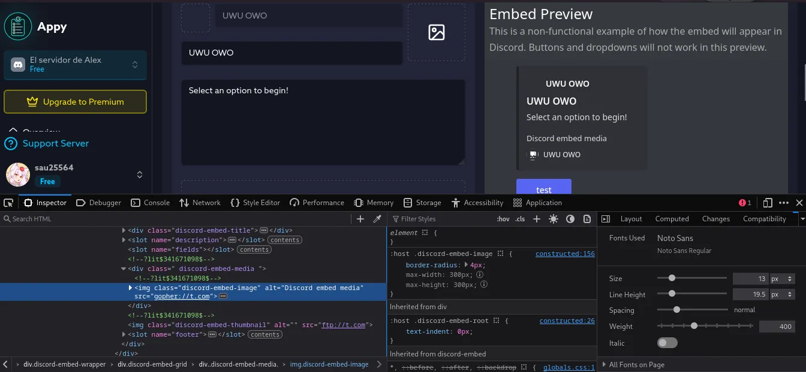
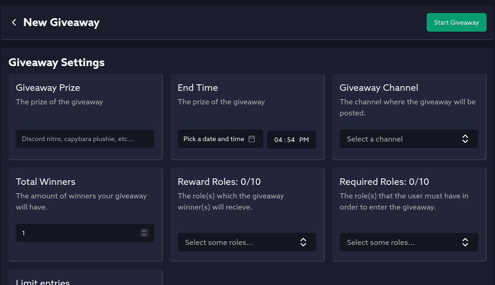

## The admin (or ban) giveaway
*Fixed on: 10/11/2025*

[Website](https://appy.bot) | [Discord](https://discord.gg/bDmc55c6zY)

Appy is a multi-purpose bot focused on the part of forms. Seems that it's very used for that.

Looking for things, I saw that the bot made validations on various parts of the site, but not in a few ones:



But nothing that were useful, so I decided to go ahead and ignore this.

There's is a section of the dashboard that let's you create giveaways with configurable options like reward roles, required roles, giveaway channel... etc:



When you create it, a tRPC request is sent to `/api/trpc/giveaway.create?batch=1`:

```json
{
   "0":{
      "json":{
         "guildId":"<Snowflake>",
         "channelId":"<Snowflake>",
         "prize":"Something",
         "description":"Win something",
         "totalWinners":1,
         "maxEntries":0,
         "endTime":"<Date>",
         "unlimitedEntries":true,
         "requiredRoles":[
            
         ],
         "rewardRoles":[
            "<Snowflake>"
         ]
      },
      "meta":{
         "values":{
            "endTime":[
               "Date"
            ]
         }
      }
   }
}
```

I tried putting something that it's not a snowflake in `rewardRoles`, and the giveaway creation was still working, just that no role would be given when it ends cause the invalid ID. Then I putted a valid role snowflake with a `#` at the end... and it would give me the role.

This means that this value is used to construct a request to the Discord API, so I decided to look for endpoints in the docs and I found this on the Guild resource:


> **Add Guild Member Role**
> 
> `PUT /guilds/{guild.id}/members/{user.id}/roles/{role.id}`
>
> Adds a role to a guild member. Requires the `MANAGE_ROLES` permission. Returns a 204 empty response on success. Fires a Guild Member Update Gateway event.

So, it's probably using this endpoint, and if i'm able to tamper with the URL, I can try to go back to the API root with `../../../../../` and then give myself a role in other server... and that worked:

<video controls>
  <source src="assets/appy3.mp4">
</video>

You can pin messages and ban members too. Just as the Carl one.

The dev fixed it real quick after I reported it.

