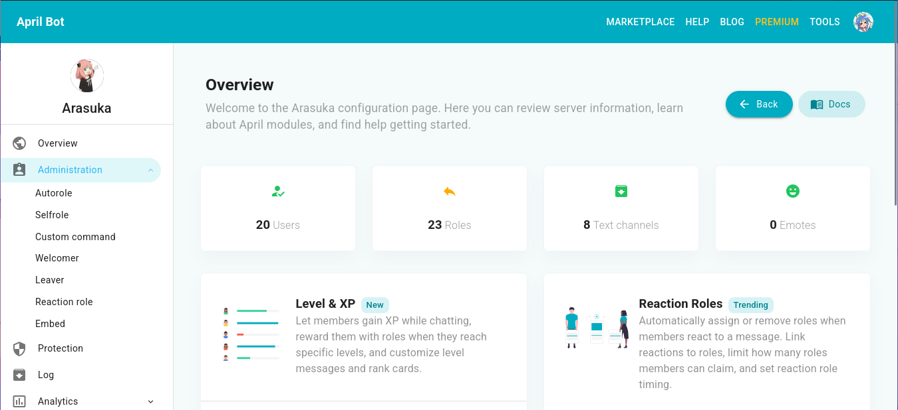
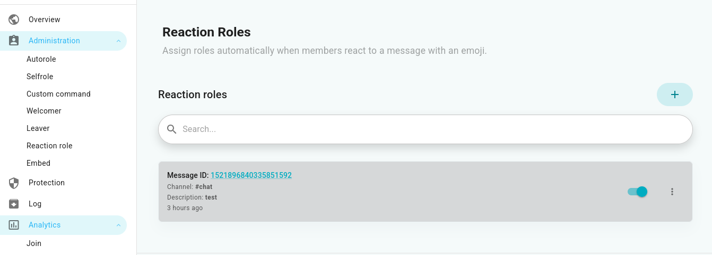

## The month for giving bans and roles
*Fixed on: 01/07/2026*

[Website](https://aprilbot.me) | [Discord](https://discord.gg/UKPKS4T)

It's not a very known multi-purpose bot with a simple style and configuration.



The bot has a reaction roles module, just as other bots:



When you create one with the default settings, this is sent via `POST` to `/api/reactionrole/{guild_id}` in `https://internal.aprilbot.me`:

```json
{
    "messageId":"<System.Integer>",
    "channelId":"<System.Integer>",
    "description":"<System.String>",
    "enabled":true,
    "thresholdLimit":null,
    "endTerm":null,
    "pickLimit":null,
    "thresholdCount":0,
    "dm":false,
    "rolesPermissionsBehaviour":"<Enum>",
    "rolesPermissionsExclude":[],
    "reactions":[
        {
            "emojiName":"<System.String>",
            "emojiId":"<System.Integer>",
            "role":["<System.Integer>"],
            "removable":false,
            "reversed":false
        }
    ],
    "managedEmbedId":"<ID>"
}
```

The website didn't verify if the `messageId` and `channelId` belonged to the actual guild, it was just doing a type check. That means I can react to any message in any channel as the bot. 

Now, I went to the edit reaction role request (that is, `PUT` to `/api/reactionrole/{guildId}/{reactionRole_id}`) which is basically the same as above but without `channelId` and `messageId`. 

Before trying things I noticed that, to create reactions in Discord, this endpoint is used:

> **Create reaction** 
>
> `PUT /channels/{channel.id}/messages/{message.id}/reactions/{emoji.id}/@me`
>
> Create a reaction for the message. This endpoint requires the `READ_MESSAGE_HISTORY` permission to be present on the current user. Additionally, if nobody else has reacted to the message using this emoji, this endpoint requires the `ADD_REACTIONS` permission to be present on the current user. Returns a 204 empty response on success. Fires a Message Reaction Add Gateway event. The `emoji` must be URL Encoded or the request will fail with `10014: Unknown Emoji`. To use custom emoji, you must encode it in the format `name:id` with the emoji name and emoji id.

So, the dashboard must be using the `emojiId` and/or `emojiName` fields as `{emoji.id}`.

I tried to append a `/@me#` or a `./` at the start of `emojiName` with a native emoji, but it didn't work. Then I tried to set the `emojiId` to an snowflake of a custom emoji, and it was working with a `./` or a `../reactions/` at the start; it means that the backend is concatening the `emojiName` string as this:

```cs
String emoji = $"{emojiName}:{emojiId}"
```

And then, it was used as it-is in the Discord API request path.

So, with `some%3a<Snowflake>/@me#` I verified that was able to eliminate the `/@me` suffix and so get the ability to redirect the `PUT` request to wherever I want. That allows me to do things like giving myself a role on other guild that the bot can control, ban people and pin messages.

https://github.com/user-attachments/assets/51fa3b3b-2fd7-4056-b8a7-2a3d218fdcf6

Both endpoints for creating and editing reaction roles were vulnerable. 

> A strange quirk of this one, is that seems it was using some outdated things, because I was only able to pin messages using the deprecated endpoint. 

The dev fixed it quickly.

