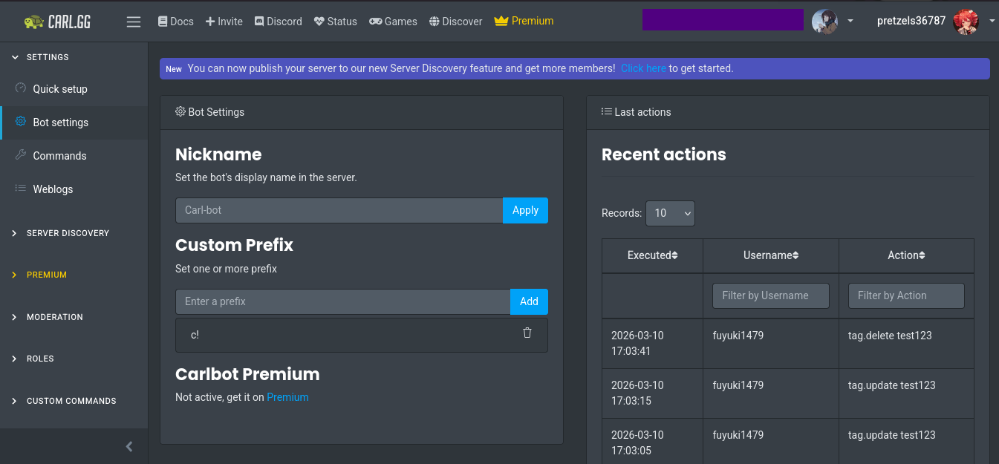
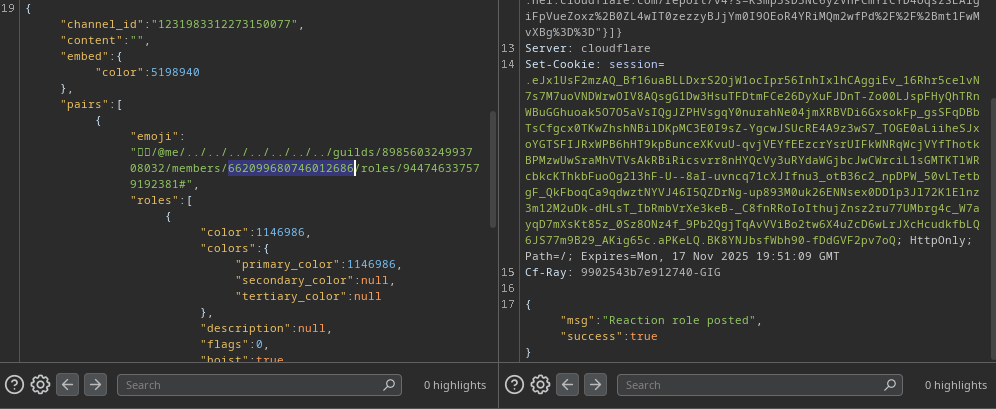
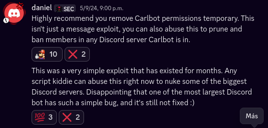

## God mode
*Fixed on: 18/10/2025 - 07/01/2026*

[Website](https://carl.gg) | [Discord](https://discord.gg/S2ZkBTnd8X)

> Of all the vulnerabilities in this repository, this is part of the most interesting ones.

Carl is a multi-purpose bot owned by BotLabs. It's #3 on the [most used Discord bots](https://gist.github.com/advaith1/451dcbca2d7c3503d4f48d63eb918cb0).

His dashboard seems pretty simple and offers basic functions among Discord guilds:



On the roles category, there's a function called "Reaction Roles" that lets you create messages with reactions. When you react on them, you will get the role that you specified.

When creating one, a `PUT` request is made to `/api/v1/servers/<guild_id>/reactionroles` with this content (mode set as "Use ID" and removing not needed fields):

```json
{
    "channel_id":"<channel_id>",
    "content":"",
    "embed":{"color":5198940},
    "pairs":[
        {
            "emoji":"😀",
            "roles":[
                {
                    "color":0,
                    "colors":{
                        "primary_color":0,
                        "secondary_color":null,
                        "tertiary_color":null
                    },
                    "description":null,
                    "flags":0,
                    "hoist":false,
                    "icon":null,
                    "id":"<role_id>",
                    "managed":false,
                    "mentionable":false,
                    "name":"<role_name>",
                    "permissions":0,
                    "permissions_new":"0",
                    "position":12,
                    "unicode_emoji":null
                }
            ]
        }
    ],
    "whitelist":[],
    "blacklist":[],
    "reaction_role_limit":0,
    "mode":1,
    "message_id":"<message_id>"
}
```

The `emoji` field looks interesting... why? because seeing the Discord documentation, I saw that you need to put emoji in the URL:

> **Create reaction** 
>
> `PUT /channels/{channel.id}/messages/{message.id}/reactions/{emoji.id}/@me`
>
> Create a reaction for the message. This endpoint requires the `READ_MESSAGE_HISTORY` permission to be present on the current user. Additionally, if nobody else has reacted to the message using this emoji, this endpoint requires the `ADD_REACTIONS` permission to be present on the current user. Returns a 204 empty response on success. Fires a Message Reaction Add Gateway event. The `emoji` must be URL Encoded or the request will fail with `10014: Unknown Emoji`. To use custom emoji, you must encode it in the format `name:id` with the emoji name and emoji id.

The only thing is that it will be urlencoded, but by the error messages I saw that the backend is made on Python (and the bot is made on Pycord). Most devs will use the `quote` function from the `urllib.parse` library... and this function has a quirk:

```python
>>> from urllib.parse import quote
>>> quote("uwu/owo/../../#?")
'uwu/owo/../../%23%3F'
```

This escapes all chars but `../`. Now, as this is a big bot, it may be using some type of proxy or balancer to contact Discord (avoid rate limits), so the `#` or `?` may get decoded... and that is what probably happened (here I gave myself a role on other server with this):



You can send a `PUT` as the bot to any endpoint of the Discord API that does not require a body, these are:

- Pin message: `/channels/{channel.id}/messages/pins/{message.id}`
- Add role to user: `/guilds/{guild.id}/members/{user.id}/roles/{role.id}`
- Ban member: `/guilds/{guild.id}/bans/{user.id}`
- Add member to thread: `/channels/{channel.id}/thread-members/{user.id}`

Contacting the dev took about two days, as there was no tickets or something, but he fixed it real quick (October 18).

Two months later, I decided to take a look again at the bot, and viewing the [TagScript](https://docs.carl.gg/#/tagstriggers?id=tag-commands) functions, I saw `{reactu: <emoji>}`

> `{reactu: :laughing: :fortnight:}`
>
> Reacts (upwards) with the emoji(s) listed to the tag’s invocation or to the message containing the trigger word.

On this one, to react with custom emoji you must put it in the format `<:emoji:[snowflake]>`. So I tested the same thing as before... and it worked.

This makes the bug very funny, because with this you can create a command (tag) like:

```
{reactu: <:02:1441484566547398787/../../../../../../guilds/{args(1)}/members/<your_id>/roles/{args(2)}#>}
Succesfully gave to you role {args(2)} in {args(1)}
```

And you can simply use it to get any role that the bot can control:

https://github.com/user-attachments/assets/35d8e6af-d06f-4d3e-815f-240dddd8c474

Now, let's see the scope of this: Carl (at this date) is on 14.200.000 servers and asks for sensitive permissions like ban members, manage server and manage roles, and many people give it a privileged position in the roles positions (and elevated permissions):

- On the Shoto's Adventurers Guild, is on position 35 of 44
- On the Bobicraft's server, is on position 127 of 140
- On the NandaTayo (Spanish VTuber) server, is on position 151 of 151
- On the Stellar Kingdom (Reino estelar) server, is on position 152 of 154
- On the PewDiePie server, is on position 138 of 144.

On some servers I can directly get admin, on others get some high value roles like mod, helper or support, and I'm pretty sure that in almost all servers I could ban normal users.

So, that's why I called this "God mode".

I reported the tagscript bug on Jan 07 and as the other, it was fixed real quick.

> I didn't report it at the moment I found it cause the support server was under the christimas holiday, and I didn't want to report it until some days later.

#### A small note aside

I've found out that on September 6, 2024, someone found an IDOR on this bot that allowed you to send messages as the bot to any guild channel and used it to do things like saying on a big game server that it will going to be shutdown. While this was ongoing, this mf said that there was also a ban exploit:



The last thing is partially true, but it seems that this guy was just lying/fearmongering about the supposed vulnerability, as the dev was not able to reproduce whatever this guy was reporting to him. This has nothing to do with the path elimination exploit (also, being a Discord bug hunter and lying like this... xd).

And, if you're the other mf who was trolling on big Discord servers with this, let me say that you're a fucking useless prick.


