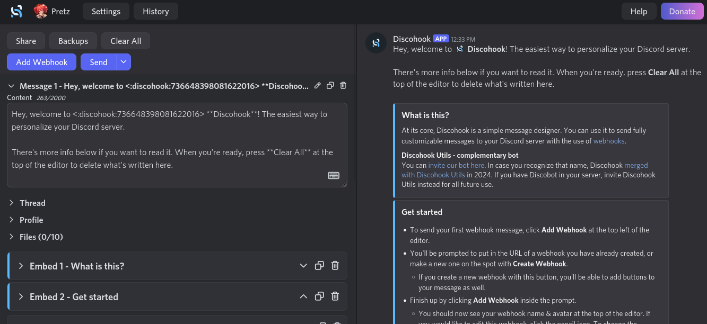
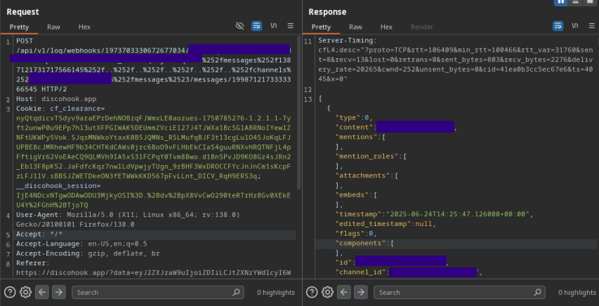

## I can spy wherever you are :eyes:
*Fixed on: 25/06/2025*

[Website](https://discohook.app) | [Discord](https://discohook.app/discord)

> Of all the vulnerabilities in this repository, this is part of the most interesting ones.

Discohook is a website mainly used to design cool messages and send them with webhooks. It's widely used among servers for this. It also has a utils bot to do this from your Discord server directly. This site is [open source](https://github.com/discohook/discohook), so I decided to take a look at his code.



When you send a message with a webhook, Discohook sends a `POST` to the endpoint `/api/v1/log/webhooks/$webhookId/$webhookToken/messages/$messageId` to verify that the message was sent and store it. The source code for this endpoint was the following:

```ts
export const action = async ({ request, context, params }: ActionArgs) => {
  const { webhookId, webhookToken, messageId } = zxParseParams(params, {
    webhookId: snowflakeAsString().transform(String),
    webhookToken: z.string(),
    messageId: snowflakeAsString().transform(String),
  });
  const { type, threadId } = await zxParseJson(request, {
    type: z.union([z.literal("send"), z.literal("edit"), z.literal("delete")]),
    threadId: snowflakeAsString().transform(String).optional(),
    // components: z
    //   .object({
    //     id: z.string().regex(/\d+/),
    //     // row: z.number().min(0).max(4),
    //     // col: z.number().min(0).max(4),
    //     flow: ZodFlow,
    //   })
    //   .array()
    //   .optional(),
  });
  const headers = await getBucket(request, context, "messageLog");

  const now = new Date();
  const messageIdSnowflake = Snowflake.parse(messageId, DISCORD_EPOCH);
  if (type === "send" && now.getTime() - messageIdSnowflake.timestamp > 15000) {
    // Allow 15 seconds to send the log request
    // This disallows people from logging any old message sent by a webhook
    // they have access to (and reduces our server's API calls in such cases)
    throw json({ message: "Message is too old" }, { status: 400, headers });
  }

  const rest = new REST({ api: context.env.DISCORD_PROXY_API }).setToken(
    context.env.DISCORD_BOT_TOKEN,
  );
  const userId = await getUserId(request, context);

  let message: APIMessage | undefined;
  if (type === "delete") {
    // Make sure the user doesn't log that they deleted a message that still exists
    const deleted = await getWebhookMessage(
      webhookId,
      webhookToken,
      messageId,
      threadId,
      rest,
    );
    if (deleted.id) {
      throw json({ message: "Message still exists" }, { status: 400, headers });
    }
  } else {
    message = await getWebhookMessage(
      webhookId,
      webhookToken,
      messageId,
      threadId,
      rest,
    );
    if (!message.id) {
      throw json(message, 404);
    }
    if (isComponentsV2(message)) {
      // We currently do not support logging these messages out of an abundance of caution
      throw json(
        { message: "Message is not loggable" },
        { status: 400, headers },
      );
    }
    if (type === "edit") {
      if (!message.edited_timestamp) {
        throw json(
          { message: "Message has never been edited" },
          { status: 400, headers },
        );
      }
      if (
        now.getTime() - new Date(message.edited_timestamp).getTime() >
        15000
      ) {
        // Allow 15 seconds to send the log request
        // This disallows people from logging any old message sent by a webhook
        // they have access to (and reduces our server's API calls in such cases)
        throw json(
          { message: "Message was edited too long ago" },
          { status: 400, headers },
        );
      }
    }
  }
  // ... [snip]
}
```

The `getWebhookMessage` does the following:

```ts
export const getWebhookMessage = async (
  webhookId: string,
  webhookToken: string,
  messageId: string,
  threadId?: string,
  rest?: REST,
) => {
  const query = threadId
    ? new URLSearchParams({ thread_id: threadId })
    : undefined;
  const data = await discordRequest<RESTGetAPIWebhookWithTokenMessageResult>(
    RequestMethod.Get,
    `/webhooks/${webhookId}/${webhookToken}/messages/${messageId}`,
    { query, rest },
  );
  return data;
};
```

This `discordRequest` function is just using the `REST#request` of discord.js, and from the source code I saw that it was using internal node functions like `fetch` to make the HTTP request, the problem here is that discord.js by default url-encodes every parameter of the path, but there was the probability that this was using a proxy or something like for the requests.

From the previous source code, I saw that if the response didn't have an `id` field, it will just return the plain response from Discord. The endpoint returns this JSON if the previous condition was true:

```json
{
    "id":"297045388538417167",
    "webhookId":"$webhookId",
    "channelId":"$channelId",
    "messageId":"$messageId",
    "webhook":{
        "id":"$webhookId",
        "discordGuildId":"$guildId",
        "channelId":"$channelId"
    }
}
```

If you read again the "if the response didn't have an `id` field, it will just return the plain", you can already think what to do: if you can't see only one resource, you **can see many of them**:



> Note that all of this is retrieved by the Discohook utils bot.

This allows you to dump entire private channel messages, threads, webhooks and see every guild where the bot is in, and if the bot has permissions (that shouldn't have): audit logs.

The dev took some hours to fix it.