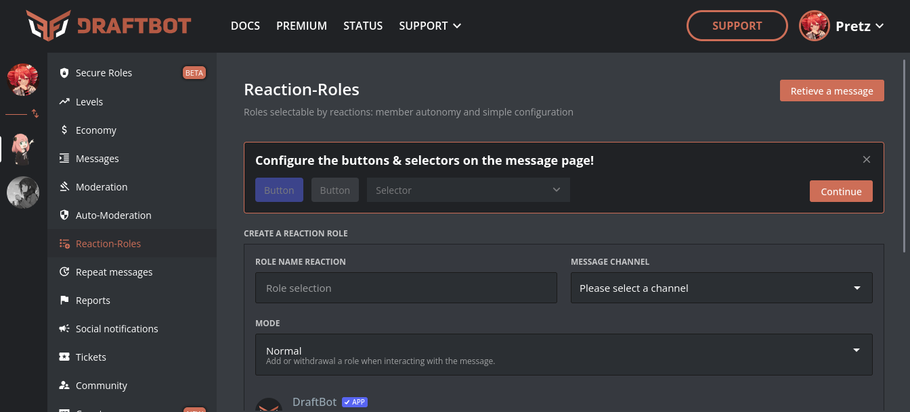

## I mean... I wanted to delete your message, not the channel.
*Fixed on: 25/04/2026*

[Website](https://draftbot.gg) | [Discord](https://discord.gg/3y4HWyFHPX)

DraftBot is a (mainly) multi-purpose french bot with various functions like Dyno and Sapphire.

They have a Reaction Roles module:



When you save and edit everything goes as usual, except by the fact that they were not validating if the IDs were actual snowflakes. I could edit the requests path but won't get anything juice because the server does validation with the retrieved object.

But when a reaction role is deleted, this request is sent:

```ruby
DELETE /dashboard/roles_reactions/:server_id/:message_id?channel_id=:channel_id
Host: api.draftbot.fr
User-Agent: Mozilla/5.0 (X11; Linux x86_64; rv:148.0) Gecko/20100101 Firefox/148.0
... [snip]
```

As this does not validate if the IDs are actual snowflakes: you know, to delete a message with ID `a` on channel `b`, you send a `DELETE` to:

`/api/v10/channels/b/messages/a`

If you put the `#` or `?` in the channel id, you will make everything that follows a parameter, so the request will become:

`/api/v10/channels/b#/messages/a` OR `/api/v10/channels/b`

This will make the bot delete the channel with id `b`, and can be used to delete anything under the `/channels` API route. And yes, the server won't differentiate if the channels is from the actual guild as it assumes that is valid following that the reaction role message id is valid.

According to the [bot's info](https://www.draftbot.gg/faq) it's using a custom version of discord.js for [microservices](https://microservices.io/), this means that probably there are some proxies behind; had to double url-encode the `#` to get it working:

https://github.com/user-attachments/assets/e5bf3498-54e6-440f-a99a-2d68d1d63810

The dev took some hours to fix it.
