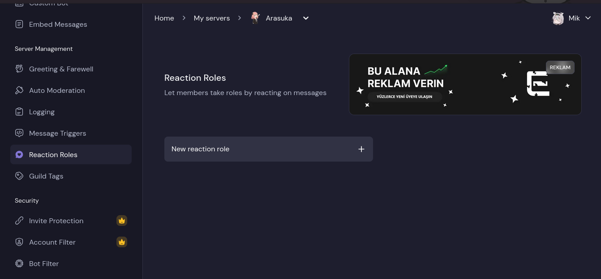

## Wasn't able to give roles :sadge:
*Fixed on: 19/06/2026*

[Website](https://eren.si) | [Discord](https://eren.si/support)

It's a well known multi-purpose bot around the Turkish Discord community, but it seems that is also used across english servers.

There is a reaction roles module:



To create one, the dashboard sends a `POST` to the `/[guild_id]/reaction-role` API endpoint with the following body:

```json
{
    "message":{
        "existingMessage":"<Boolean>",
        "message":"<String>"
    },
    "emojiId":"<String|Snowflake>",
    "channelId":"<Snowflake>",
    "addRoles":[
        "<Snowflake>"
    ],
    "removeRoles":[
        "<Snowflake>"
    ],
    "DMNotifications":"<Boolean>"
}
```

So, when using a unicode emoji, the backend was just checking that the first character of the `emojiId` field was a unicode emoji but nothing else, and the `/@me#` fragment at the end didn't change the request behaviour (creating the message and adding the reaction), so I have control over the `Create Reaction` request. I tried to pin a message but then I noticed that there was a 65 chars limit. Using the deprecated endpoint (sums up to 63 characters) bypassed that limit:


But at this moment, the module was made in a simple way such that you can only create the reaction but not change it (the server deletes the old reaction and adds the new one). So it was the only thing that I was able to do.

The dev took a day to fix it.
