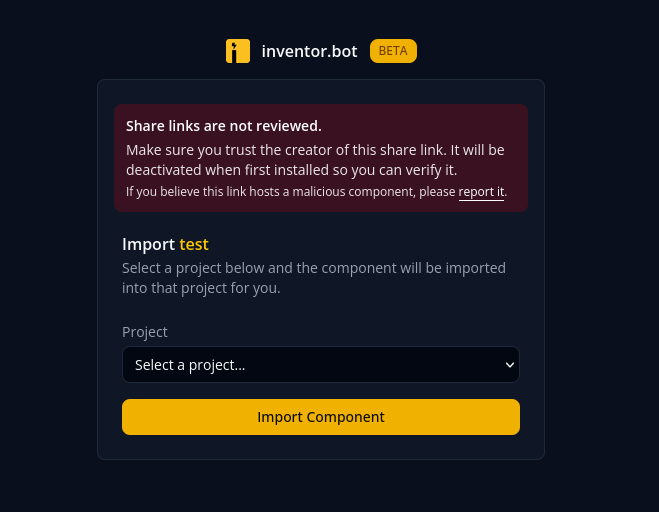

## But the component was supposed to be safe!
*Fixed on: 01/10/2026*

[Website](https://inventor.bot) | [Discord](https://inventor.rocks)

This is a website that is like BotGhost but more advanced and with more functions. It could be said that it's inherently more secure than the latter. At the time of this finding, it was in beta.


The dashboard is hosted at `https://dash.inventor.bot`. I was watching the frontend routes and, on the `/auth/forgot/verify/<verify-code>` (used for the forgot password flow), I saw that the verification code is placed in the path of a `GET` API request to `/api/auth/forgot/<verify-code>` which is triggered when you access the page. Trying to set the verify code to `%2e%2e%2fuwuowo` (encoded dot segment) redirected the request to `/api/auth/uwuowo`... something smelling bad there already.

The same bug was present on other routes like login verification and feedback post view, but there was nothing exploitable at all because they were just `GET` requests. Then I found the route used to share bot components (handlers or commands), which is `/dash/share/<uuid>`:



On load, this sends a `GET` to `/api/share/<uuid>`. Setting the share uuid to a payload similar to the one before indeed redirects the API request, and even if the resource throws a 40x error, the page will still load as if a share link with that id actually existed.

> At the moment of finding, the "Import [component name]" thing wasn't there yet.

When you hit the `Import` button, the frontend sends this request:

```http
POST /api/share/<uuid>/import HTTP/1.1
Host: dash.inventor.bot
Content-Type: application/json

{"project_id":"[string]"}
```

As you may have already guessed, we can also control the path of that request. Every route of the API uses `POST` for actions that mutate stuff, so it's useful.

Now, watching how the backend handles `POST` requests, I noticed that almost every mutation endpoint was using the content type `multipart/form-data`, but for some reason, the backend was also accepting the required fields in the query string. i.e., you can send this:

```http
POST /api/user/change_name?username=owo&confirm=true HTTP/1.1
Host: dash.inventor.bot
Content-Type: multipart/form-data; boundary=----geckoformboundary2983c3877b5bd43daf76cccef7c90f89

------geckoformboundary2983c3877b5bd43daf76cccef7c90f89
Content-Disposition: form-data; name="username"

my_name
------geckoformboundary2983c3877b5bd43daf76cccef7c90f89
Content-Disposition: form-data; name="confirm"

false
------geckoformboundary2983c3877b5bd43daf76cccef7c90f89--
```

And the backend will only take the values in the query string, not the ones in the body. As it's ignoring the body, that means that we can also change `Content-Type` to `application/json` and the request will still succeed, which makes possible using the path traversal shown before to do unintended actions like opening tickets, creating feedback posts, or even changing the user's name when they click the Import button:

https://github.com/user-attachments/assets/922e072f-9894-47a5-8f17-43d2979aa12c

You could also change their project settings, but that would require knowing the target project ID.

The devs fixed it quickly. They also fixed the flawed `POST` request parsing.