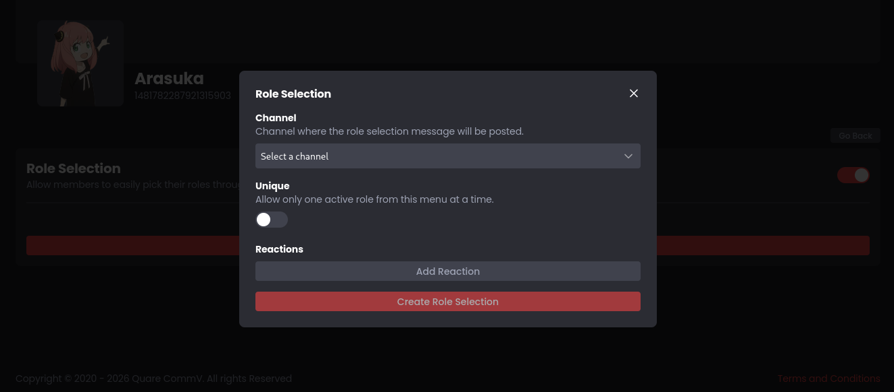
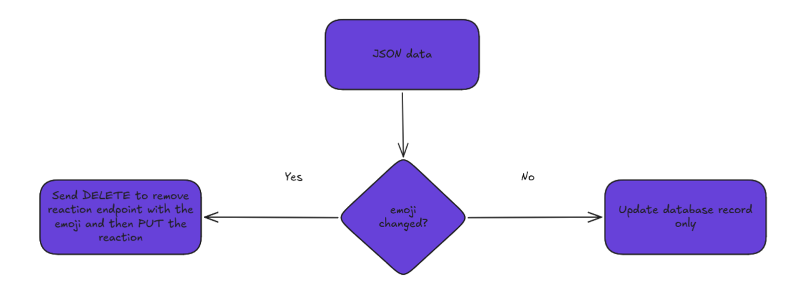

## PUT -> DELETE -> PUT -> ... is a funny chain
*Fixed on: 09/03/2026*

[Website](https://maki.gg) | [Discord](https://maki.gg/support)

> On this one I used some LaTeX, so it's better to read it on a web browser.

It's a multi-purpose bot owned by Quare CommV. Has various functions just like Dyno and Sapphire and also an [API](https://api.maki.gg/docs), so other developers can interact with the bot.

As the other bots, this has the function to create a menu for role selection with reactions:



This request is sent by `POST` to the API endpoint `/guilds/:guild_id/role_selection` when you create one (removing useless fields):

```json
{
    "channel_id":":channel_id",
    "unique":false,
    "reactions":[
        {
            "emoji":":emoji",
            "roles":[":role_id"],
            "random_roles_amount":1,
            "mode":"toggle"
        }
    ],
    "components":[
        {
            "type":17,
            "components":[
                {
                    "type":10,
                    "content":"Pick a role!"
                }
            ]
        }
    ]
}
```

I tried to play with the `reactions[n].emoji` field and I saw that adding an `/@me#` at the end or `./` at the beginning won't change the request behaviour. So it's being part of the path of a request to this endpoint:

> **Create reaction** 
>
> `PUT /channels/{channel.id}/messages/{message.id}/reactions/{emoji.id}/@me`
>
> Create a reaction for the message. This endpoint requires the `READ_MESSAGE_HISTORY` permission to be present on the current user. Additionally, if nobody else has reacted to the message using this emoji, this endpoint requires the `ADD_REACTIONS` permission to be present on the current user. Returns a 204 empty response on success. Fires a Message Reaction Add Gateway event. The `emoji` must be URL Encoded or the request will fail with `10014: Unknown Emoji`. To use custom emoji, you must encode it in the format `name:id` with the emoji name and emoji id.

I tried to go back to the API root with `../../../../../` and try to pin a message, but I got a catch... there was a 60 characters limit.

The `../../../../../` are already 15 characters. An snowflake already takes $[18,19]$ characters, and the words like `channels` and `messages` takes $8$ and $7$ characters, so if we assume that everything is maximized. Doing basic math gives $2(19) + 15 + 8 + 7 = 68$ (multiply by two as we need to put two snowflakes)

There is a deprecated endpoint to pin messages (`/channels/{channel.id}/pins/{message.id}`). With that we take away $7$ characters from the value (the word `messages`), and as we are on channels already, we can remove a `../` and the `channels` word, so we remove $11$ characters and, $2(19) + 4 = 42$


Good, but we can't give roles ourselves as the url is too large (three snowflakes, `guilds`, `members`, `roles`: $3x + 6 + 7 + 5 \geq 60$). Nonetheless I noticed something, and it was that the backend removes the previous emoji if it was modified, even if Maki didn't was able to create the reaction; you can put something like `aadasd` and firstly it will throw a `500 Internal Server Error`, but after that it will go ok, and if you modify it, it will throw the error again, in summary the server was doing this:



I can also control the path of the `DELETE` request, so by reviewing lengths, I could do this (note that $x$ is the ID length and the other number is the total path length without counting the snowflake):

- Make the bot leave a guild, `../../../../../users/@me/guilds/{guild.id}#` ($x + 32 \leq 52$)
- Delete channels, `../../../../{channel.id}#` ($x + 12 \leq 32$)
- Unpin messages (the same as pinning a message)
- Delete messages, `../../../../{channel.id}/messages/{message.id}#` ($x + 22 \leq 60$ only if the channel or the message was created before 2022)
- Delete invites, `../../../../../invites/{invite.id}#` ($x + 23 \leq 49$)

https://github.com/user-attachments/assets/3aa56f72-2f95-44bf-acfe-182aa2dcfb5e

The devs fixed the bug real quick after I reported it.