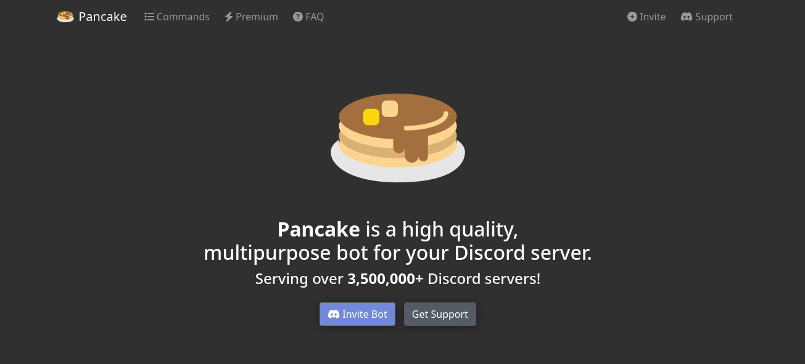

## Adding pancakes to your messages!
*Fixed on: 06/06/2026*

[Website](https://pancake.gg) | [Discord](https://pancake.gg/support)

It's a multipurpose bot that (at this date) is Discord only, does not have a dashboard. It uses the old prefix commands rather than the new slash commands and also uses embeds and reactions over components.

The bot has a command for creating and editing embeds, both called `embedcreate` and `embededit`:

> `p!embededit`
> 
> You can edit the embed from Pancake.
> There is a lot of info so just go through everything step by step.
> 
> Usage: `p!embededit <channel> <messageID> <title | description | color | thumbnail | image | footer | > author | addfield | removefield | setfield> [text]`

Welp, by testing this command I noticed that it only validated that the channel introduced belongs to the actual guild, but doesn't make any checks against the `messageID`, so I was able to go back in the API request path and edit an embed message sent by the bot on other server by url-encoding the respective characters. I had to encode the characters to get it working:

https://github.com/user-attachments/assets/a4448950-3afd-45f3-8ac8-d0ad931d4c3a

> **Trivia:** Following [this list](https://gist.github.com/advaith1/451dcbca2d7c3503d4f48d63eb918cb0), this bot is made in Eris, but on this library this bug should not be possible because it uses the native Node http module to send requests. Guess that either the list is wrong or a proxy is doing his magic.

The command for creating embeds has an option to grab embeds from other messages, and it also had this bug. But it's not actually useful as it only allows getting the embed from the message (and you can't see private channels in API responses anymore).

It's useful for content spoofing, as the bot's messages are mainly on embed format, and surely there are servers that sends things like their rules using embeds from this bot. 

Devs fixed it, but they didn't give me a callback.