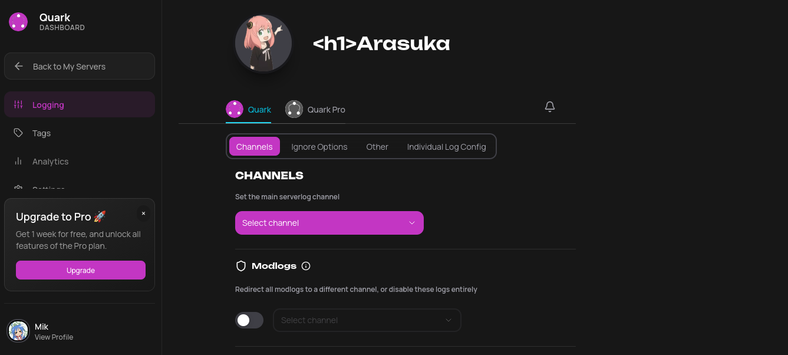
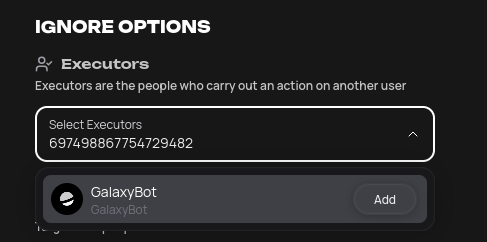
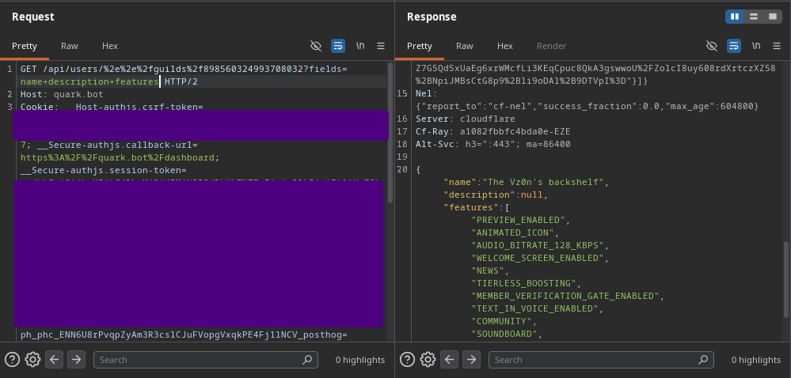
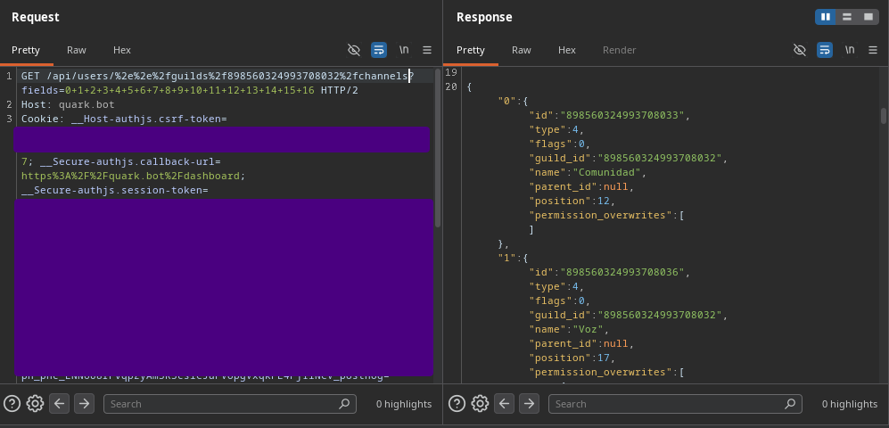

## The logger is the only thing reading messages... *or maybe not?*
*Fixed on: 24/06/2026*

[Website](https://quark.bot) | [Discord](https://quark.bot/support)

This bot is basically a utility focused on logs. It has an extra module for tags but it's all around logging things that happens in the guild.

While I was testing, I noticed that the dashboard gets some values like the username and the profile picture from users to show them as search results:

To do this, this makes a GET request to `/api/users/[user_id]?field=[fields]`. The `fields` parameter in the request sent by the panel is `avatar username id`; this identifies which fields may be retrieved from the JSON response. So I added in the `user_id` snowflake a encoded `#` at the end & `./` at the start and it was still working, then I tried to traverse and send a request to `/guilds/{guild.id}` and it worked.

That's full control over the `GET` request sent to the Discord API. You may think that maybe is a problem that some endpoints returns an array as the response (like the channel messages one), but this isn't because JavaScript threats arrays almost the same as objects, so we can put on `fields` numbers and we will get the array elements:

So is the same as [Discohook](discohook.md). I can see private channels (more valuable now) with their messages, audit logs and webhooks. Being able to get these things is almost guaranteed on every guild as this is a logging bot and asks for Administrator by default.

The dev fixed it quickly.