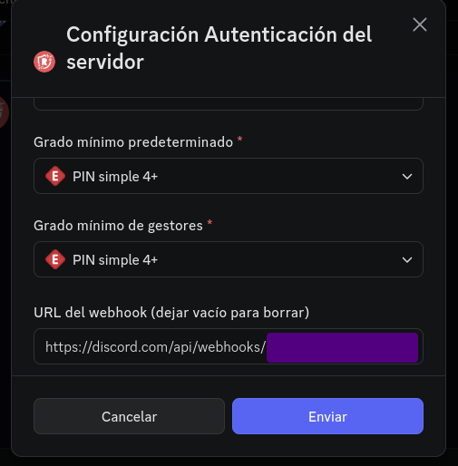

## RaidProtect is typing...
*Fixed on: 22/05/2026*

[Website](https://raidprotect.bot) | [Discord](https://discord.gg/raidprotect)

I think the name of the bot pretty much describes what it's for. At this date is Discord only and doesn't have a dashboard.

While watching the `/auth-settings` command, I noticed that you can configure a Webhook which the bot will use to send role auth logs:

This did validate that the url starts with the format `https://discord.com/api/webhooks/[...]`... yeah, only checked if it starts with that, so you can go back in the route with `../` and redirect the request to other endpoints. As this will send messages, that means that you can point to channels of other guilds to send your log messages (for some reason, the bot was sending the Webhook request with the token, and you don't need to do that).

As this is a `POST` request, you can also do some other stuff:

- Trigger the typing indicator
- Begin a guild prune with the default values
- Create new roles with the default values
- Crosspost messages in announcements channels
- Create an invite with the default values

https://github.com/user-attachments/assets/1cda6322-321f-4f08-b981-5082a00eb321

The dev fixed it quickly after I reported it.
