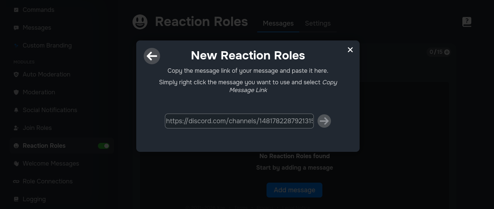
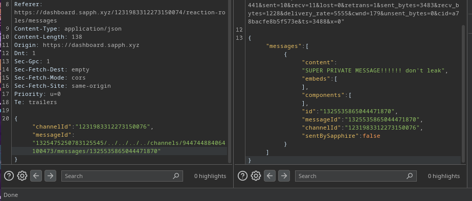
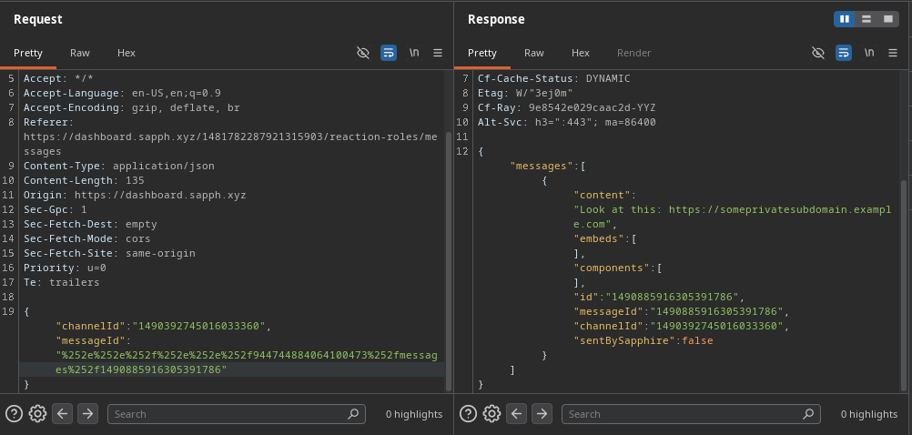

## Leaking your staff channel messages!
*Fixed on: 06/01/2025 - 08/04/2026*

[Website](https://sapph.xyz) | [Discord](https://sapph.xyz/server)

Sapphire is a well known bot around the Discord community, and it has various good features for server owners, like AI moderation.

The reaction roles function lets you load a message with a link:



This is sent to `/api/v1/discord/bots/channelmsgs-$channelId` via `POST`

```json
{
    "channelId":"$channelId",
    "messageId":"$messageId"
}
```

This won't load any message from other channels that aren't part of my guild, but I noticed that if I add a `#` at the end of the message id, it still works. So I was able to go back in the path and get a message from other channel:



Now, the channel object in the Discord API has always assigned a `last_message_id` field, and is visible even if you don't have permissions to access the channel:

```json
{
    "id":"<Snowflake>",
    "type":0,
    "last_message_id":"<Snowflake>",
    "flags":0,
    "guild_id":"<Snowflake>",
    "name":"\u0b68\u0b67\u02da\ud83d\udcd6\u02dadiscord-mods\u00b0\ua4b1",
    "parent_id":"<Snowflake>",
    "rate_limit_per_user":0,
    "topic":"Todas las actualizaciones de Discord sobre los servidores se mostrar\u00e1n ac\u00e1.",
    "position":11,
    "permission_overwrites":[
        {"id":"<Snowflake>","type":0,"allow":"0","deny":"1024"}
    ],
    "nsfw":false
},
```

With a simple script, you could fetch the channel every $x$ time and if the `last_message_id` changes, fetch it with this vulnerability, dumping almost every new message.

> **Note on this (Jun, 2026):** Discord is planning to hide the private channel names from API responses if you don't have permission to view them, this could make this exact type of bug harder to exploit. And if the `last_message_id` field is also hidden, that would render this attack vector almost useless.

I reported this on Jan 06, 2025 and it was fixed quickly.

One year later, I decided to take another look at the bot, and tried to double url encode the characters (like, `#` -> `%2523`), and I was able to read a message from a private channel again.



So, the dev fixed it quickly (again) after reporting it.

