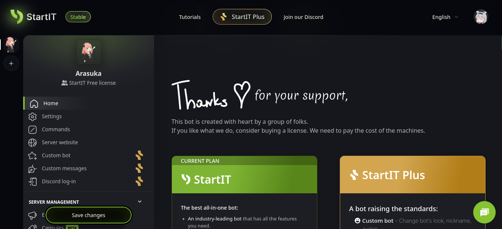
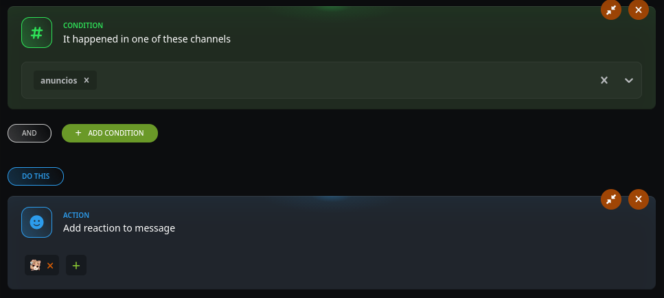

## The bot is reacting zaza
*Fixed on: 07/06/2026*

[Website](https://startit.bot) | [Discord](https://discord.gg/GEanJ2g)

It's an all-in-one (multipurpose) bot. Is the one behind [discord.builders](https://discord.builders) and it winned the #1 spot in the "Bot of the year" selection of top.gg's 2025 awards (which I can't give a link because those mf for some reason deleted the page and now it's the default Next.js 404 page)



The automation module has an action that lets you add a reaction to the message which triggered it:



The JSON body of this reaction action was the following:

```json
{
    "type":"add_reaction",
    "reactions":[
        "<String>"
    ]
}
```

As you may expect if you readed other cases, this sends a `PUT` request to `/channels/{channel.id}/messages/{message.id}/reactions/{emoji.id}/@me`. Adding a `./` to the start of the emoji wasn't breaking the reaction but `#` and `?`, which makes this case a bit weird as on other bots I was successfully able to cancel the `/@me` fragment and get full control of the `PUT` request, but on this one I was only able to make the bot react to any messages on anywhere or add it to any thread. 

The dev fixed it quickly.