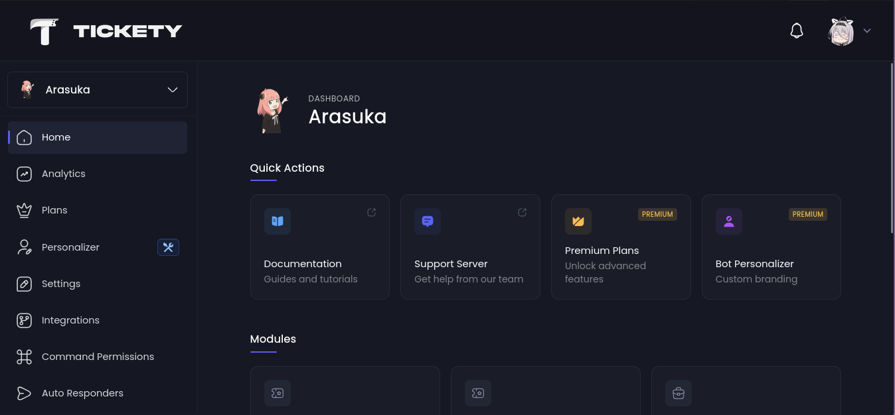
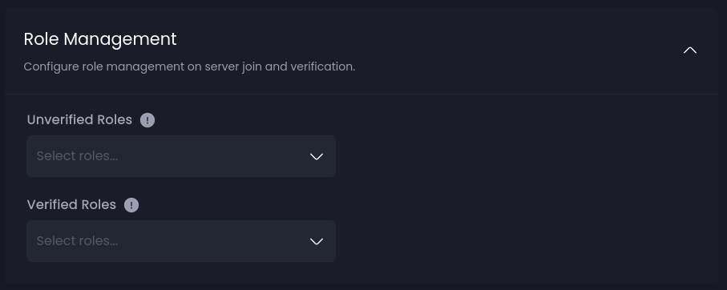

## The admin (or ban) giveaway, but now with verification included
*Fixed on: 28/05/2026*

[Website](https://tickety.top) | [Discord](https://discord.gg/tickety-support-804846334346526752)

It's a Ticket Management bot with some extra features like a verification system and giveaways. Their dashboard seems cool:



The bot has a verification module and works much like the captcha.bot, Wick or YAGPDB ones. It also lets you assign unverified and verified roles to be given when a user joins and when it completes the verification:



To save settings of this module, the snowflakes of the selected roles are sent to `/api/guilds/:guild_id/verification/config` under this key:

```json
{
    "roles":{
        "verified":[],
        "unverified":[]
    }
}
```

I tried to add a snowflake with a `./` at the beginning and a `#` at the end of a value in the `roles.unverified` array and indeed, it was still working; it was sending a `PUT` request to `/guilds/{guild.id}/members/{member.id}/roles/{role.id}`. So I tried to path traverse and pin a message on a channel of other guild and it worked. This is triggered every time that a member joins to the server. With the `roles.verified` array didn't work as the bot was trying to convert the value to a long before doing anything.

Given this, I also decided to give a shot to the Giveaways module. When creating one, this was the body of the request to create a giveaway sent to `/api/guilds/:guild_id/giveaways`:

```json
{
  "action": "create",
  "prize": "<String>",
  "description": "<String>",
  "channelId": "<Snowflake>",
  "hostedBy": "",
  "pingRole": "<Snowflake>",
  "durationType": "<Enum>",
  "durationValue": "<Strtime>",
  "winnersCount": 1,
  "requiredRoles": [],
  "blockedRoles": [],
  "bypassRoles": [],
  "winnerRoles": [
    "<Snowflake>"
  ],
  "boostedRolesExtraEntries": false
}
```

There was no validation made against the `channelId`, and the `winnerRoles` array had the same behaviour as the verification module unverified role value. That means that I can also send the giveaway message to other channels where I don't have permissions to write (and pinging @everyone) or do things like triggering the typing indicator of the bot, as this is a `POST` request and I can control the path.

https://github.com/user-attachments/assets/373de6b8-6ef8-4201-9094-a7c9cc2d1c88

The dev took a little to fix it.