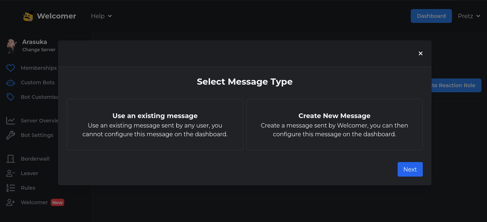

## Rocking your validation
*Fixed on: 22/04/2026*

[Website](https://welcomer.gg) | [Discord](https://welcomer.gg/support)

This bot is basically for what his name indicates: welcoming functions. And it's [open source](https://github.com/WelcomerTeam/Welcomer)

It has the reaction roles function:



This creates, edits and deletes the reaction roles in mass; that means it just modify an array of elements with a `POST` to `/api/guild/{guild.id}/reactionroles`:

```json
{
    "reaction_roles":[
        {
            "enabled":true,
            "is_system_message":true,
            "message":"{\"embeds\":[{\"description\":\"React below to get roles!\"}]}",
            "roles":[
                {
                    "emoji":"{emoji_id}",
                    "role_id":"{role_id}",
                    "name":"",
                    "description":""
                    }
            ],
            "channel_id":"{channel_id}",
            "type":"emoji"
        }
    ]
}
```

It validates every field including the emoji, but viewing the code I saw that it does so only if the reaction role is enabled:

```go
// welcomer-backend/backend/routes_guild_settings_reactionroles.go

	for i, rr := range partial.ReactionRoles {
		if !rr.Enabled {
			continue
		}
		
		// ... [snip]
    }
```

And then proceeds to do everything as if the reaction role was enabled, I can already send messages to channels of other guilds with this. So I decided to look deeper on the emoji thing and saw that this bot is [using a custom wrapper for the Discord API](https://github.com/WelcomerTeam/Discord)

The function that creates reactions `CreateReaction`, does the following:

```go
func CreateReaction(ctx context.Context, session *Session, channelID, messageID Snowflake, emoji string) error {
	endpoint := EndpointMessageReaction(channelID.String(), messageID.String(), emojiEscaper.Replace(emoji), "@me")

	err := session.Interface.FetchJJ(ctx, session, http.MethodPut, endpoint, nil, nil, nil)
	if err != nil {
		return fmt.Errorf("failed to create reaction: %w", err)
	}

	return nil
}
```

that `emojiEscaper` is defined as:

```go
var emojiEscaper = strings.NewReplacer("#", "%23")
```

It only url-encodes the `#` char, and everything else is sent as it is via the `http` go library, that *normalizes the path by default*.

So with this and bypassing the "escaper" by using the `?` character, you can send any message to other channels and send a `PUT` to any Discord endpoint:

<video controls>
  <source src="assets/welcomer2.mp4">
</video>

The dev took some hours to fix it.


