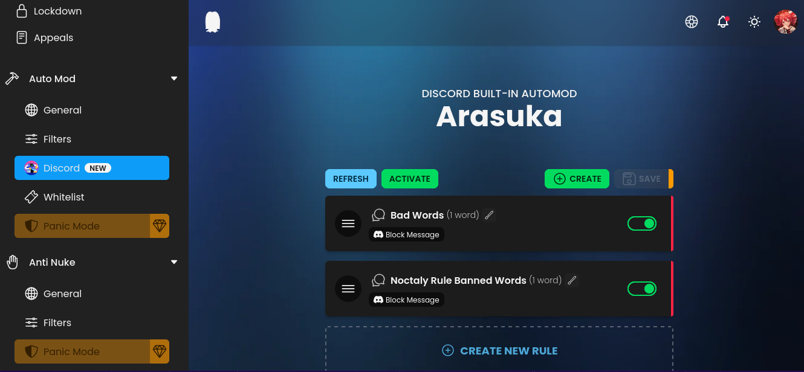
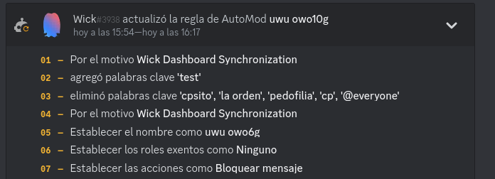
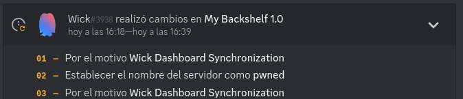
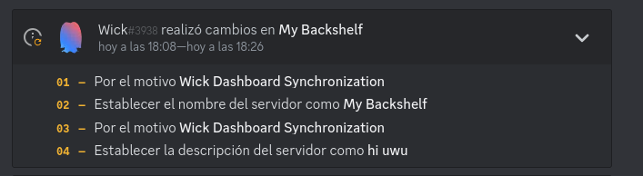

## You have raid protection? Well, I'll hack the protection!
*Fixed on: 04/01/2025*

[Website](https://wick.bot) | [Discord](https://wick.bot/support)

> Of all the vulnerabilities in this repository, this is part of the most interesting ones.

Wick is probably one of the most used and recommended anti raid & protection bots.

The dashboard has a function to manage Discord auto mod rules:



When you save a rule, this is sent by `POST` to `/api/fetch/guilds/:guild_id/builtinautomod/save`

```json
{
    "data":[
        {
            "id":"<Snowflake>",
            "name":"<String>",
            "event_type":1,
            "actions":[
                {
                    "type":1,
                    "metadata":{
                        "custom_message":"<String>"
                    }
                }
            ],
            "trigger_type":1,
            "enabled":"<Boolean>",
            "exempt_roles":"Array<Snowflake>",
            "exempt_channels":"Array<Snowflake>",
            "trigger_metadata":{
                "keyword_filter":"Array<String>",
                "regex_patterns":"Array<Regex>",
                "allow_list":"Array<?>"
            }
        }
    ]
}
```

So, I putted a `#` at the end of the automod rule id and it stopped working, but with the url-encoded version (`%23`) it was working. Going to the Discord API docs I saw this route:


> **Modify Auto Moderation rule**
>
> `PATCH /guilds/{guild.id}/auto-moderation/rules/{auto_moderation_rule.id}`
>
> Modify an existing rule. Returns an auto moderation rule on success. Fires an Auto Moderation Rule Update Gateway event.

So, I tried to slowly go back in the patch with `%2e%2e/rules/<rule-id>` and so on; still working. And when I got into `/guilds`, I tried to edit a moderation rule from other server with `%2e%2e%2f%2e%2e%2f%2e%2e%2f<guild-id>/auto-moderation/rules/<rule-id>`, and it worked:



With this, I got into the API root but there was something that is unknown to me, and is... every other field on that request that is not from Wick is sent to the Discord API? can I add other fields?

I need to test it... but even if the answer to the second question was false, I have a `name`, and the endpoint to edit a guild `/guilds/{guilds.id}` accepts it, has no required fields and the Discord API ignores every other field that is not part of the expected schema. So let's test.

At the first attempt, I didn't work, but when I made the injected path look uglier as I noticed that it wont accept more than three `%2e%2e%2f` joined together (i.e `%2e%2e%2f%2e%2e%2f%2e%2e/a/%2e%2e%2f%2e%2e%2fguilds/<guild-id>`)... it worked:



Now, I removed every non essential field from the request, preserved the `name` and added a `description`, and well:



So, I can send a `PATCH` request to anywhere with any JSON field that I want.

This is **extremely lethal** as this is an anti-raid bot, and it normally requires a high spot in the roles positions with admin permissions. You can even edit the application profile and their slash commands.

The dev quickly fixed the issue when he knowed about. He gave me a little scolding for using it to do things like changing a custom bot's name of a spanish Discord partner server called [Programadores y Estudiantes (PyE)](https://discord.gg/programacion) to "uwu owo"
