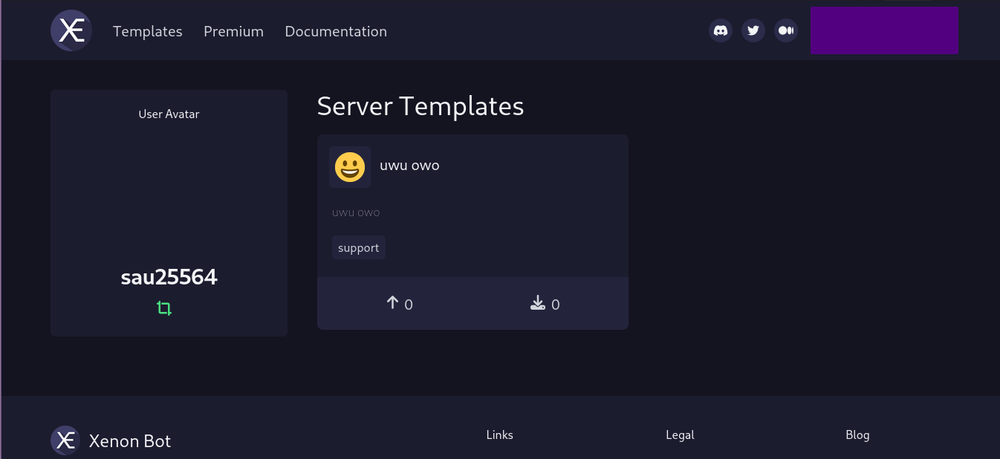
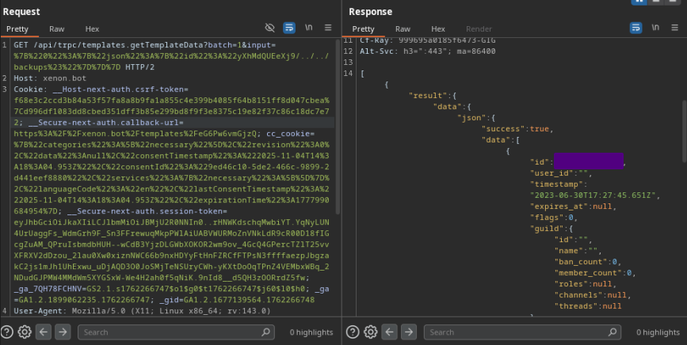
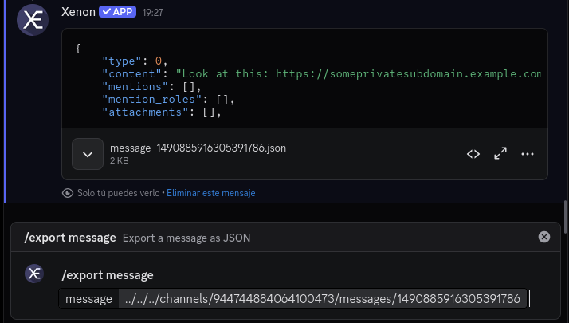

## Getting your backups (and messages)!
*Fixed on: 08/11/2025 - 09/05/2026*

[Website](https://xenon.bot) | [Discord](https://xenon.bot/discord)

Xenon is a Discord bot made for creating and managing backups of Discord servers, that is: roles, channels and even messages if you pay a subscription. It lets you easily copy and paste servers in case that you need it (such an example case would be if someone nukes your server).

On the website, you can create server templates that other people can use and review them:



This website uses [tRPC](https://trpc.io/) as design, they have various methods for getting and setting data. An interesting one was `templates.addTemplate`, invoked when you create a template. The input is:

```json
{
    "0":{
        "json":{
            "id":"$templateId",
            "emoji":"$emoji",
            "language":"$lang",
            "tags":[]
        }
    }
}
```

Following the same reasoning as the bots, I tried to put a `#` at the end of the template id and it was still working, so I tried to go back and I noticed that, instead of cancelling the path of the Discord API request, it was cancelling the path of the *request to an internal API*.

I was trying to search for endpoints that accepts `POST` in that internal API, but I didn't find anything. Also tried to control the request that was going to be sent to Discord and I did it, but I wasn't able to get anything rather than guild templates and users; the internal server was made on Go and thus it tries to convert the returned JSON object to the expected type.

But, by searching with the `templates.getTemplateData` method endpoints that accepts `GET`, I found an endpoint called `backups` that showed me some server backups:



and I was able to dump them. They had sensitive info like logs messages with real emails and payments info.

Now, this was on the website. I looked at the bot and the command `/export message` had the same vulnerability, restricted to only messages by Go type safety. But knowing the same Discord fact from the Sapphire bug, I could easily extract the last message of any channel that the bot can see, with all of their attributes (including attachments):



> **Note:** Since Jun 19, 2026 Discord hides private channels from API responses if you don't have permission to view them. The only way to exploit this specific bug now, is by getting a full message url from somebody else.

The website bug was fixed quickly by the dev, but took some days to read my message. It also tried to fix the bot vulnerability at the same date (08/11/2025), but whatever he made didn't work, and after that he didn't answer me anymore. But as he also made message.style and [I found a XSS in there](/xss/message.style.md), I took advantage and reported the bug again, and this time, he actually fixed it.  