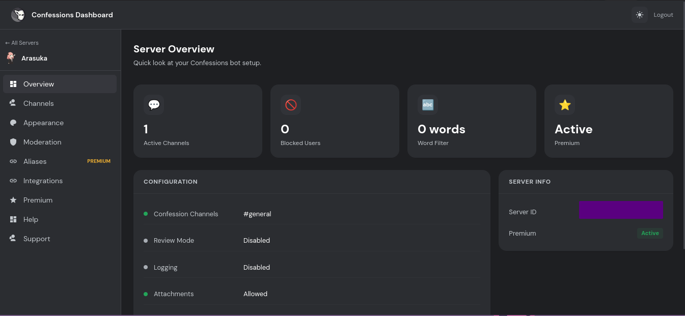
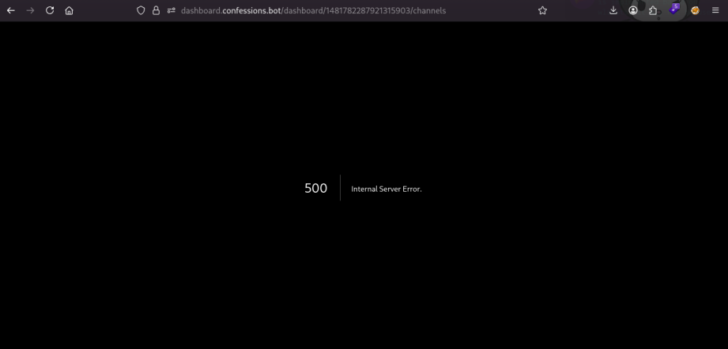

## when the Internal server error
*Fixed on: ??/05/2026*

[Website](https://confessions.bot) | [Discord](https://discord.gg/confessions)
 
It's a bot made mainly for what his name means; confessions.

They have a dashboard, and at the moment it was in beta stage:



When saving any setting, this was sent via `PATCH` to `/api/guilds/:guild_id/config`, where `key_n` represents a configuration section and `key_n+1` its values:

```json
{
    "key_1.key_2.key_3...key_n":"<value>"
}
```

or $key_1.key_2.key_3...key_n = v_n$ in math notation. So, I tried to put a key that does not exists and the server threw an error. But with `__proto__.value` everything was going okay, then I tried to put `__proto__.__proto__.t` with value 123... and the server crashed:



The `/dashboard/:server_id/channels` was throwing that, and the root page just went into a login loop.

The devs placed the dashboard into maintenance and took some days to fix it. Don't know when exactly it was fixed as they didn't notify it.

