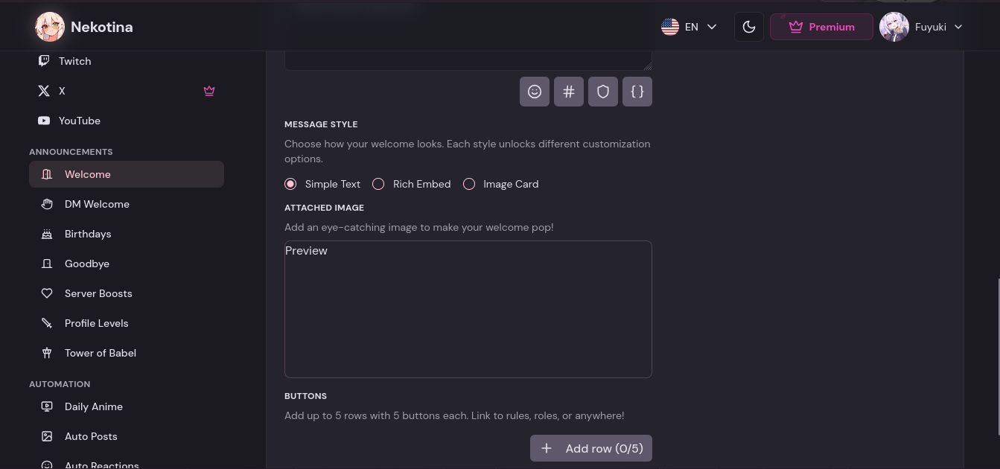
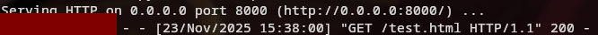
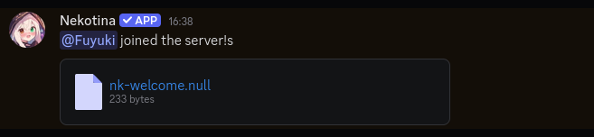

## Here is you welcome imag... wtf?
*Fixed on: ??/11/2025*

[Website](https://nekotina.com) | [Discord](https://nekotina.com/discord)

Nekotina is a mainly spanish multi purpose bot that is basically a must-have in almost all of the Discord spanish community. The most used features are the interaction/roleplay commands and global economy system.

There is a module that lets you create a welcome message, with many options:



When you save settings, this is sent via server components:

```ruby
------geckoformboundaryd3dea44df3c4992be565b71cfa88a49e
Content-Disposition: form-data; name="1_payload_json"

{
  "channelId":null,
  "content":"Here is your response!",
  "card": {
      "font":"Inter",
      "imageUrl":null,
      "overlayColor":"#000000",
      "overlayOpacity":0.75,
      "subtitle":"We are {{members}} members now",
      "textColor":"#FFFFFF",
      "title":"{{username}} joined the server!"
  },
  "embed":{
      "author":null,
      "title":null,
      "description":null,
      "color":null,
      "thumbnail":null,
      "image":null,
      "fields":null,
      "footer":null
  },
  "type":"text",
  "imageUrl":null,
  "ignoreBots":false,
  "components":[]
}
------geckoformboundaryd3dea44df3c4992be565b71cfa88a49e
Content-Disposition: form-data; name="0"

[{"status":"idle"},"$K1"]
------geckoformboundaryd3dea44df3c4992be565b71cfa88a49e--
```

I tried to tamper the `imageUrl` field with an URL that points to a simple HTML page, and when I triggered the module, a request was received:



And Nekotina sent this weird attachment:




This file had the plain response from my server, and when I tried to contact `127.0.0.1` it was also retrieving me the responses from internal services.

I reported it, but for some reason the bot devs didn't contact me back. They just solved the issue.